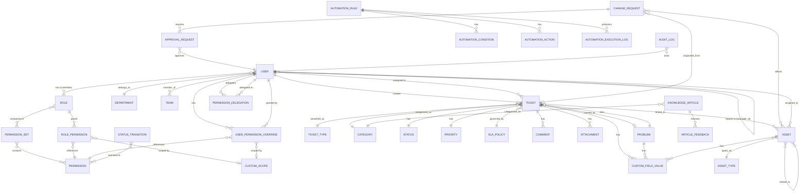
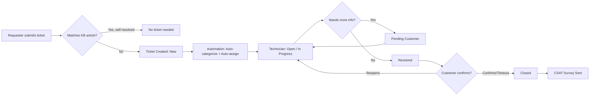

# The In-House IT Support Portal — Development Constitution

**Version:** 1.0
**Status:** Foundational specification — governs all development decisions
**Framework Alignment:** ITIL 4
**Reference Systems:** Motadata ServiceOps, ServiceNow, Jira Service Management
**Intended Consumer of This Document:** Development team / AI coding agent (Claude Code)

---

## Preamble

This document is the single source of truth for the design, build, and evolution of the in-house IT Support Portal ("the Portal"). Like a constitution, it does not describe every implementation detail line-by-line — it establishes the **non-negotiable structure, principles, and contracts** that every module, screen, and API must respect. Where an implementer must choose between two paths and this document is silent, the choice must be justified against Part I (Principles) and recorded in an Architecture Decision Record (ADR) per Part XIV.

This document supersedes the original lightweight specification. Nothing in the original scope is lost — it is expanded, structured, and made buildable.

### Companion Document

This constitution is read alongside **`Support_Portal_Functional_Reference.md`**, which specifies behaviour at the field, rule, setting, and algorithm level — the operational detail this document deliberately does not carry. Where the two differ the constitution governs, **except where the Functional Reference's Part Q formally amends it**.

**Amendments in force** (recorded in Functional Reference Part Q):

| ID        | Effect                                                                                                                  | Amends                                                            |
| --------- | ----------------------------------------------------------------------------------------------------------------------- | ----------------------------------------------------------------- |
| **A-001** | Three-layer permission model: roles + per-user grants/revocations, per-permission scope, organizational hierarchy scope | Part V (rewritten), 7.3 (added), 8.3 (added), Part XII (rephased) |
| **A-002** | Automation observability ships with the automation engine, not after it                                                 | Part IV, Article VII                                              |
| **A-003** | One parameterized configuration framework instantiated per module                                                       | Part III                                                          |
| **A-004** | ITIL Version 5 forward compatibility: explainable, overridable automated decisions                                      | 1.3                                                               |
| **A-005** | Deterministic, resource-bounded intelligence is in scope; model-based is not                                            | 1.5                                                               |
| **A-006** | Deferral register: `[Defer]` items are postponed with a stated trigger, distinct from excluded items                    | Part XII                                                          |

---

## Table of Contents

- Part I — Vision, Principles & Scope
- Part II — Functional Specification (Core ITIL4 Modules)
- Part III — Customization Framework
- Part IV — Automation Engine
- Part V — Access Control, Identity & Security
- Part VI — System Architecture
- Part VII — Data Model
- Part VIII — API Design
- Part IX — UI/UX Specification & Prototypes
- Part X — Technology Stack
- Part XI — Non-Functional Requirements
- Part XII — Development Roadmap
- Part XIII — Testing Strategy
- Part XIV — Governance & Amendment Process
- Appendices

---

# PART I — VISION, PRINCIPLES & SCOPE

## 1.1 Vision Statement

A single, self-hosted portal that gives a small-to-mid-size organization enterprise-grade IT service management (ITSM) capability — incident, request, problem, change, and asset management under one ITIL4-aligned roof — without the license cost, vendor lock-in, or bloat of commercial platforms, while remaining as configurable as those platforms for the workflows that matter to this organization.

## 1.2 Guiding Principles (Articles)

These principles override convenience or shortcuts at every layer of development:

1. **Article I — API-First.** Every capability the UI offers must exist as a versioned REST API first. The web, mobile, and desktop clients are consumers of the same API — never a special back-door.
2. **Article II — Configuration Over Code.** Ticket types, fields, workflows, SLAs, and roles must be admin-configurable through the UI wherever technically feasible, not hardcoded, so the organization can evolve the system without a developer.
3. **Article III — Least Privilege by Default.** No user, role, or integration receives more access than its function requires. New roles start with zero permissions.
4. **Article IV — Auditability.** Every state-changing action (ticket update, permission change, automation firing, login) is attributable, timestamped, and immutable in the audit trail.
5. **Article V — Single Data Model, Multiple Surfaces.** Web, mobile, and desktop render the same underlying entities. No surface may maintain its own divergent schema or business logic.
6. **Article VI — Progressive Disclosure.** Simple tasks (raise a ticket) must take a novice end-user under 60 seconds. Power/admin features are layered behind roles, not hidden entirely.
7. **Article VII — Fail Safe, Not Silent.** Automations and integrations must log failures visibly to admins; a broken automation must never silently drop a ticket.
8. **Article VIII — Own Your Data.** No mandatory third-party SaaS dependency for core function. Self-hosted database, file storage, and auth must always be a supported deployment path.

## 1.3 ITIL 4 Alignment

The Portal implements the following ITIL 4 practices. This mapping is authoritative — module names in Part II map 1:1 to these practices.

| ITIL 4 Practice                     | Portal Module                        | Priority |
| ----------------------------------- | ------------------------------------ | -------- |
| Incident Management                 | 2.1 Incident Management              | P0 (MVP) |
| Service Request Management          | 2.2 Service Request Management       | P0 (MVP) |
| Service Desk (practice, not module) | Realized via 2.1 + 2.2 + 2.8         | P0 (MVP) |
| Problem Management                  | 2.3 Problem Management               | P2       |
| Change Enablement                   | 2.4 Change Enablement                | P2       |
| Knowledge Management                | 2.5 Knowledge Management             | P1       |
| Service Configuration Management    | 2.6 Asset & CMDB                     | P1       |
| Service Level Management            | 2.7 SLA/OLA Management               | P1       |
| Monitoring & Event Management       | Integration hook only (Part IV.8)    | P3       |
| Continual Improvement               | 2.9 Reporting & Analytics feeds this | P2       |

Priority key: **P0** = MVP/Phase 1, **P1** = Phase 2, **P2** = Phase 3, **P3** = Phase 4+.

> **Amendment A-004.** ITIL Version 5 was announced in early 2026, with publications rolling out through the year; **ITIL 4 remains the practical baseline** and Version 5 builds on it rather than replacing its foundations. Two Version 5 directions are adopted now because they are cheap to accommodate and expensive to retrofit: (a) every automated or inferred decision stores a reason and permits human override (Functional Reference F7); (b) the Service Catalog item model must not assume "service" excludes "product". Full practice-to-module map: Functional Reference A3.

## 1.4 Personas

| Persona                         | Description                                                             | Primary Surface                 |
| ------------------------------- | ----------------------------------------------------------------------- | ------------------------------- |
| **Requester** (End User)        | Any employee raising tickets. No ITSM knowledge assumed.                | Self-service portal, mobile     |
| **Technician (Agent)**          | Handles assigned tickets, works the queue.                              | Agent web console, mobile       |
| **Team Lead**                   | Owns a queue/department, reassigns, monitors SLA breaches.              | Agent console + team dashboards |
| **Change/Problem Manager**      | Runs CAB, links problems to incidents.                                  | Agent console, advanced modules |
| **Administrator**               | Configures fields, workflows, roles, automations, integrations.         | Admin console                   |
| **Auditor** (read-only)         | Views audit logs, reports; cannot modify data.                          | Reporting + audit views only    |
| **Integration/Service Account** | Non-human identity used by monitoring tools, email-to-ticket, webhooks. | API only                        |

## 1.5 Scope

**In scope:** Incident, Service Request, Problem, Change, Knowledge, Asset/CMDB, SLA, self-service portal, RBAC, automation/business rules engine, custom fields/forms, dashboards & reporting, notifications (email + in-app + push), CSAT surveys, audit logging, REST API, responsive web app usable on desktop and mobile browsers, installable PWA, optional native wrapper.

> **Amendment A-005.** The original blanket exclusion of "AI-based ticket triage" is narrowed. **Deterministic and statistically simple intelligence is in scope** — duplicate detection, priority-weighted routing, knowledge deflection, resolution memory, anomaly signals — because it is cheap, explainable, and high-value (Functional Reference Part F). Model-based, predictive, and LLM-dependent features remain out of scope or deferred. Binding constraint: no model training, no vector database, no GPU, no per-request external call in the hot path.

**Out of scope (v1):** Full CMDB dependency mapping/service maps, native React Native apps (deferred — see 10.3), billing/chargeback, multi-tenant SaaS hosting for external customers, AI-based ticket triage (flagged as a future extension point, not built in v1).

## 1.6 Success Metrics

- Ticket creation to first-response median time (tracked, not hardcoded target — org sets its own SLA)
- % of tickets resolved via self-service/KB deflection
- SLA compliance %
- Automation coverage: % of tickets touched by at least one automation
- Admin configuration changes made without developer involvement (proves Article II)

---

# PART II — FUNCTIONAL SPECIFICATION (CORE ITIL4 MODULES)

## 2.1 Incident Management

**Purpose:** Restore normal service operation as fast as possible after an unplanned interruption.

- Unified ticket object shared with Service Requests (`ticket.type = INCIDENT`), per original spec — see Part VII.
- **Status workflow (configurable per Article II, default below):**
  `New → Open → In Progress → Pending (Customer) → Pending (Vendor) → Resolved → Closed → Reopened`
- **Priority Matrix:** Priority is _derived_, not freely chosen, from Impact × Urgency (standard ITIL 5x5 or 3x3 matrix, admin-configurable grid — see 3.x).
- **Major Incident flag:** any incident can be escalated to "Major Incident," which triggers: dedicated Slack/email broadcast, war-room ticket linking, executive-visible dashboard, and mandatory post-incident review task.
- Multi-level categorization: `Category > Subcategory > Item` (e.g., Hardware > Laptop > Screen).
- Rich text description & replies (inline image paste, drag-drop attachments, PDF/log uploads), full reply history threaded like an email client.
- **Merge & Link:** duplicate incidents can be merged; related incidents can be linked to a Problem (2.3).
- **Reopen window:** configurable number of days after Closed during which a user reply reopens the ticket automatically.

## 2.2 Service Request Management (+ Service Catalog)

- Requests use the same ticket table (`ticket.type = SERVICE_REQUEST`) but a distinct workflow template is allowed per catalog item (Article II).
- **Service Catalog:** admin-built grid/list of catalog items, each with: icon, name, description, category, a **dynamic request form** (custom fields, see 3.1), optional approval requirement, and a target fulfillment SLA.
- Catalog items can require **multi-stage approval** (e.g., manager approval → IT approval) before entering the fulfillment queue — see 4.4.
- Catalog items can auto-generate **fulfillment tasks/checklists** for the assigned technician (e.g., "Provision Laptop" → 5 sub-tasks).

## 2.3 Problem Management

- A `Problem` entity, distinct table, represents the underlying root cause of one or more Incidents.
- Incidents can be linked to a Problem (many-to-one).
- Problem workflow: `New → Investigating → Known Error → Resolved → Closed`.
- **Known Error Database (KEDB):** a Problem marked "Known Error" with a documented workaround is surfaced to technicians when a matching Incident is raised (basic keyword/category match in v1; can be manual-link only in MVP).
- Root Cause Analysis (RCA) field: structured template (Root Cause, Workaround, Permanent Fix, Preventive Action).

## 2.4 Change Enablement (Change Management)

- `ChangeRequest` entity, distinct table and workflow.
- Change types: **Standard** (pre-approved, low-risk, template-driven, no CAB needed), **Normal** (requires CAB approval), **Emergency** (expedited approval path, post-implementation review mandatory).
- Workflow: `Draft → Submitted → CAB Review → Approved/Rejected → Scheduled → In Progress → Implemented → Review → Closed`.
- Fields: Risk level, Impact, Rollback plan, Implementation plan, Scheduled window (start/end), linked Assets, linked Incidents/Problems that necessitated the change.
- **Change Calendar:** a calendar view of all Scheduled/In Progress changes to detect conflicts (blackout windows configurable by admin).

## 2.5 Knowledge Management

- `KnowledgeArticle` entity: title, body (rich text), category, tags, visibility (Public/Internal/Team-restricted), status (Draft/Review/Published/Archived), version history.
- Full-text search across articles, surfaced in: (a) self-service portal search bar, (b) suggested articles panel while a Requester is typing a new ticket (deflection), (c) technician-side "insert into reply" shortcut.
- Article feedback (thumbs up/down + comment) feeds into 2.9 reporting.
- Simple approval workflow before publishing (Draft → Review → Published) — reuses the generic Approval mechanism (4.4).

## 2.6 Asset & Configuration Management (Lightweight CMDB)

- `Asset` entity: tag, type, model, serial, status (In Stock/Active/In Repair/Retired), assigned user, assigned department, location, purchase date, warranty expiry.
- **Asset Types** are admin-definable with **custom attributes** (Article II) — e.g., a "Laptop" type might have CPU/RAM/OS fields; a "Software License" type has seat count/expiry.
- Ticket–Asset association (many-to-many): full history of tickets per asset is visible on the asset record.
- **Basic relationship graph** (v1): Asset → Asset (e.g., "Monitor connected to Laptop"), rendered as a simple node graph — not a full dependency-mapping CMDB (explicitly out of scope per 1.5).
- CSV import/export for bulk asset onboarding.
- Warranty/license expiry gets an automated reminder (ties into Part IV automation).

## 2.7 SLA / OLA Management

- `SLAPolicy` entity: name, conditions (matches on ticket type, priority, category, department), response time target, resolution time target, business-hours calendar reference.
- **Business Hours Calendar:** admin-defined working hours, holidays, timezone — SLA timers pause outside business hours (configurable per policy: 24x7 vs business-hours-only).
- SLA timers: **First Response** and **Resolution**, each with Warning threshold (e.g., 80% elapsed) and Breach state, both visually flagged (amber/red) on ticket lists.
- Pending states pause the resolution clock; policy defines which statuses pause vs. continue the clock.
- OLA (Operational Level Agreement) — same structure as SLA but between internal teams (e.g., Network team owes Service Desk a 4-hour ack) — reuses `SLAPolicy` table with a `scope = OLA` flag.

## 2.8 Self-Service Portal

- Service Catalog grid (2.2) as the front door.
- "My Tickets" — list + detail, with comment/attachment ability, satisfaction rating on close.
- Global search (tickets + KB articles).
- "Report an Issue" quick form with AI-free keyword-based KB suggestions before submission (deflection).
- Organization announcements/banner (e.g., "Email outage in progress" — tied to Major Incident flag in 2.1).

## 2.9 Reporting & Analytics

- Pre-built dashboards: SLA compliance, ticket volume trend, agent workload/leaderboard, CSAT trend, category breakdown, asset inventory summary.
- **Custom Report Builder** (Article II) — see 3.5.
- Scheduled report emails (PDF/CSV export) to stakeholders.
- Export raw data (CSV) for any list view.

## 2.10 Notification System

- Channels: in-app (bell icon + toast), email, and push (web push for PWA / mobile push if native app exists).
- Every notification type is a row in a `NotificationTemplate` table — admin-editable subject/body with merge fields (`{{ticket.id}}`, `{{ticket.title}}`, etc.) — Article II compliance.
- Per-user notification preferences (which events, which channel).
- Digest mode option (batch non-urgent notifications hourly/daily) to avoid alert fatigue.

## 2.11 Surveys / CSAT

- Auto-sent 1–5 star (+ optional comment) survey on ticket Closed.
- Results roll into 2.9 dashboards and can be filtered by technician/team/category.

---

# PART III — CUSTOMIZATION FRAMEWORK

Customization is a first-class module, not an afterthought — this section exists because Article II demands it.

## 3.1 Custom Fields Engine

- Field types: Text, Text Area, Number, Date, Datetime, Dropdown (single), Multi-select, Checkbox, User Picker, Asset Picker, Attachment.
- Fields are attachable to: Ticket (per type/catalog item), Asset (per Asset Type), Change Request, Problem.
- Field metadata: label, help text, required flag, default value, visibility conditions (see 3.3 conditional logic), validation regex (for text).
- Stored via an EAV-style `CustomFieldValue` table (Part VII) to avoid schema migrations every time an admin adds a field.

## 3.2 Custom Forms & Templates

- Each Service Catalog item / Ticket Type has a **Form Builder**: drag-and-drop ordering of standard + custom fields, section grouping, conditional show/hide ("if Category = Hardware, show Asset Picker").
- Form versioning: editing a live form doesn't retroactively alter already-submitted tickets' stored data.

## 3.3 Workflow / Status Customization

- Admins define **Status Sets** per ticket type/catalog item (not one global workflow) — e.g., a "New Hire Onboarding" request might have `Requested → Approved → Provisioning → Ready → Closed` instead of the generic Incident flow.
- **Transition rules:** which roles can move a ticket from Status A → B; optional required fields on a given transition (e.g., "Resolution Notes" mandatory to move to Resolved).
- Visual workflow editor (state diagram, drag to connect) — see prototype in Part IX.

## 3.4 Business Rules Engine

Covered fully in Part IV (it is the automation engine), but the **authoring UI** is a customization surface: Trigger → Condition(s) → Action(s), built with dropdowns, no code required.

## 3.5 Dashboard & Report Builder

- Widget types: Number/KPI tile, Bar chart, Line/trend chart, Pie/donut, Table, Leaderboard.
- Data source = any entity + filter + group-by + aggregate (count, avg, sum) chosen via UI, not SQL — this keeps report authoring inside the "no code" boundary of Article II while power users can still request a raw CSV export for anything advanced.
- Dashboards are personal (per user), team, or organization-wide (admin-pinned).

## 3.6 Branding / Theming

- Logo, primary/accent color, portal name, custom email footer — stored as a single `OrgSettings` config, applied via CSS variables at runtime (ties to frontend design system, Part IX).
- Light/Dark mode toggle, per-user preference, is a baseline requirement (not "branding" but grouped here as a personalization feature).

## 3.7 Multi-Department Considerations

- `Department`/`Team` entities scope: queues, SLA policies, custom fields (some fields may be department-specific), and dashboards.
- Not a full multi-tenant architecture (single organization, single DB schema) — see 1.5 scope and Article VIII.

---

# PART IV — AUTOMATION ENGINE

## 4.1 Automation Engine Architecture

A generic **Trigger → Condition(s) → Action(s)** model, evaluated by a rules-processing service, decoupled from the main request/response cycle via a job queue (Part VI.7) so automation never blocks the user-facing API.

```
Event occurs (ticket created / updated / SLA tick / scheduled cron)
        │
        ▼
  [ Event Bus / Queue ]
        │
        ▼
 [ Automation Worker ] ── loads matching Rules for this event type
        │
        ▼
 For each Rule (ordered by priority):
    evaluate Conditions (AND/OR groups)
        │  match?
        ▼
   Execute Actions (in order) ── logged to AutomationExecutionLog
        │
        ▼
   On failure: retry (configurable) → else flag to Admin (Article VII)
```

**Trigger types:** Ticket Created, Ticket Updated (field-level: status/priority/assignee changed), Comment Added, SLA Threshold Reached (warning/breach), Scheduled/Cron, Asset Warranty Approaching, Webhook Received (inbound, from 4.8).

**Condition types:** field equals/not-equals/contains, field changed from X to Y, requester/department equals, custom field value comparisons, time-based (e.g., "created > 3 days ago").

**Action types:** Change field (status/priority/assignee/etc.), Add comment (internal or public), Send notification (email/in-app), Assign to user/team (see 4.2), Create linked task/sub-ticket, Call outbound webhook (4.8), Add tag.

## 4.2 Auto-Assignment / Routing

Selectable strategy per queue/department:

- **Round Robin** — even rotation among available agents.
- **Load-Based** — assign to the agent with fewest open tickets.
- **Skill/Category-Based** — mapping table of Category → preferred team/agent.
- **Manual** — falls into an unassigned queue for a Team Lead to triage.

## 4.3 SLA Escalation Engine

- Runs as a scheduled worker (ticking every N minutes) checking open tickets against their `SLAPolicy` timers.
- At Warning threshold: notify assigned agent. At Breach: notify agent + Team Lead, optionally auto-reassign or auto-raise priority (admin-configured action chain, reusing 4.1's Action list).

## 4.4 Approval Workflows

- Generic `ApprovalRequest` entity: linked to any approvable object (Service Request, Change Request, Knowledge Article).
- Supports **sequential** (Manager → IT Director) and **parallel** (any 2 of 3 approvers) chains, defined per catalog item/change type.
- Approvers act via in-app action or one-click email approve/reject link (secure, signed token, single-use).

## 4.5 Scheduled / Recurring Tickets

- `TicketSchedule` entity: cron-like recurrence (e.g., "create a Server Health Check ticket every Monday 8am") — generates a real ticket at each fire, using a stored template.

## 4.6 Auto-Close / Auto-Resolve Rules

- E.g., "If status = Resolved and no customer reply in 5 days → auto-Close." Configurable per ticket type.

## 4.7 Macros / Canned Responses

- Agent-facing: predefined text snippets (and optionally field changes bundled together) triggered with one click while replying — reduces repetitive typing, distinct from admin-authored automation rules but stored in a similar Action-list structure for reuse.

## 4.8 Integration-Triggered Automation

- **Inbound:** Email-to-ticket (a monitored mailbox creates/updates tickets), generic inbound webhook endpoint (for monitoring tools like Zabbix/Nagios/Uptime Kuma to open incidents automatically).
- **Outbound:** Any Action in 4.1 can be "Call Webhook" — posts a JSON payload to a configured URL (e.g., push into Slack/Teams, or a CI/CD system for a Change ticket).
- All integrations are configured through Admin > Integrations, with per-integration enable/disable and a delivery log (Article VII — visible failures).

---

# PART V — ACCESS CONTROL, IDENTITY & SECURITY

## 5.1 Authentication

- **Local auth** (email + password, bcrypt/argon2 hashed) always available as a fallback (Article VIII — never mandatory third-party dependency).
- **SSO** via SAML 2.0 and OIDC/OAuth2 — pluggable, configured in Admin > Authentication, so the org can wire in Azure AD/Entra ID, Google Workspace, Okta, or Keycloak.
- **LDAP/Active Directory** bind-based auth as an additional pluggable provider (common for on-prem banking/enterprise environments).
- **MFA:** TOTP (authenticator app) mandatory-by-policy option, enforceable per role (e.g., mandatory for Admin role).

## 5.2 Permission Model — Three Layers

> **Revised by Amendment A-001** (Functional Reference, Part Q). The original two-layer role→permission model is superseded. Authoritative specification: **Functional Reference Part I**. Data model: **7.3** below.

Effective permissions are computed from three composable layers:

```
EFFECTIVE PERMISSIONS =
      ( union of permissions from the user's ROLES )
    + ( user-level GRANTS      — additive, per individual )
    − ( user-level REVOCATIONS — subtractive, per individual )
  ⨯ ( SCOPE: own / group / department / location / hierarchy / custom / all )
```

**Layer 1 — Roles.** Named bundles of permissions representing job functions, composed from reusable **permission sets**. Most users need nothing beyond roles; the other layers are exceptions, not the norm.

**Layer 2 — User-level overrides.** An administrator may grant an individual a permission their roles don't confer, or revoke one their roles do. This exists because organizations always contain people whose access doesn't match a clean job function, and minting a role per exception produces role sprawl that is harder to audit than the exceptions.

**Layer 3 — Scope.** Every permission is evaluated against a scope determining _which records_ it applies to. Scope is assigned **per permission, not per role** — a user may hold `request.view` at `department` scope while holding `request.edit` at `own`.

### Resolution rules (must be unambiguous)

1. **Revocation always wins.** No "grant overrides revoke" case, so revocation is a reliable safety instrument.
2. **Grants are additive across roles** — multiple roles union rather than conflict.
3. **Grants may widen scope; revocations may only remove.**
4. **Overrides are visible.** A user whose effective permissions differ from their roles' is flagged in the user list and on their profile, with deltas enumerated. Invisible exceptions become forgotten exceptions.
5. **Every override carries** grantor, timestamp, required justification, and optional expiry.

### Enforcement

- Permission checks happen **server-side on every API call**. The frontend hides UI the user lacks access to, but that is UX only, never the security boundary.
- Scope is enforced in the **data layer, once**, via a single `applyScope(query, user, permission)` helper. Enforcing scope per endpoint guarantees an endpoint eventually gets missed — and the miss is a data leak, not a visible bug.

### Default roles (seeded, all duplicable)

Super Admin · Service Desk Technician · Request Specialist · Problem Specialist · Change Specialist · Team Lead · Change Manager · Knowledge Manager · Dashboard Viewer · Report Viewer · Auditor · Requester.

**Predefined roles are permission-locked** (membership editable, permission set not) so an administrator cannot accidentally lock everyone out. Organizations needing a variant duplicate the role.

The complete permission catalogue (~150 entries across all modules, including transition-level permissions) is in **Functional Reference I2**.

## 5.3 Scope Resolution & Organizational Hierarchy

| Scope        | Meaning                                                                 |
| ------------ | ----------------------------------------------------------------------- |
| `own`        | Records where the user is requester, assignee, watcher, or collaborator |
| `group`      | Records belonging to the user's technician group(s)                     |
| `department` | Records in the user's department, optionally including sub-departments  |
| `location`   | Records at the user's location, optionally including child locations    |
| `hierarchy`  | The user **and everyone reporting to them, transitively**               |
| `custom`     | Records matching an admin-defined attribute filter                      |
| `all`        | Unrestricted                                                            |

**Hierarchy scope** is new in A-001. Each user carries an optional `manager_id` forming a reporting tree **independent of the department tree** — departments describe where you work, the reporting tree describes who answers to you, and these are frequently different shapes. Depth is configurable per assignment (`hierarchy:1` for direct reports, `hierarchy:*` for the full subtree), because "my direct reports" and "my entire division" are different grants.

**Custom scopes** are named, reusable attribute filters (including over custom fields) assignable to a role or an individual — e.g. "Technician, but only tickets where Location = Colombo and Category = Network." Reusability matters: one scope assigned to nine people stays consistent; nine hand-built filters drift.

## 5.3a Privilege Safety Rules (non-negotiable)

A granular grant/revoke system without these is **more dangerous** than the fixed model it replaces:

1. **No self-escalation** — a user cannot grant themselves a permission, edit a role they hold, or modify their own overrides.
2. **No privilege amplification** — a user cannot grant another user permissions exceeding their own effective set.
3. **Last-administrator protection** — the system blocks any operation leaving zero active users with full admin permissions.
4. **Justification required** on every grant and revocation, stored in the audit record.
5. **Forced logout on permission change** — a revocation that only takes effect at next login is not a revocation.
6. **Step-up MFA** for permission grants, role edits, API key creation, and data export.
7. **Periodic access review** — a report of every user-level override, with a review reminder. This is the control that prevents slow privilege accumulation, and the artefact an auditor asks for.

## 5.4 Multi-Factor Authentication

- Covered in 5.1; additionally: forced MFA re-challenge for sensitive admin actions (role changes, integration secrets) — step-up auth pattern.

## 5.5 Audit Logging

- `AuditLog` entity: actor, action, entity type/id, before/after diff (JSON), timestamp, IP/user-agent.
- Logged: logins (success/fail), permission/role changes, ticket field changes, automation rule changes, integration credential changes, data exports.
- Immutable (append-only table, no update/delete permission at the application layer).

## 5.6 Data Security

- TLS 1.2+ enforced in transit (reverse proxy terminates TLS, internal traffic on a private network/VPC).
- Encryption at rest for the database volume and file storage volume (disk-level, e.g., LUKS, or managed-disk encryption if cloud-hosted).
- Secrets (SSO client secrets, webhook signing keys, DB credentials) stored in a secrets manager or `.env` outside version control — never in the database in plaintext.
- Automated encrypted backups (Part XI).

## 5.7 API Security

- JWT-based session tokens (short-lived access token + rotating refresh token), or server-side session with secure/httpOnly cookies — **decision recorded as ADR-001**, default recommendation: httpOnly cookie session for the first-party web app + separate long-lived API keys (scoped, revocable) for service accounts/integrations.
- Rate limiting per user/IP at the reverse proxy and app layer.
- Input validation and output encoding to prevent injection/XSS; parameterized queries only (ORM enforced).
- CSRF protection on cookie-based sessions.

## 5.8 Session Management

- Configurable session timeout (idle + absolute), forced logout on password/role change, "active sessions" self-service view + admin-forced revoke.

## 5.9 Compliance Considerations

- Since this may serve banking-adjacent proposal work (per organizational context), the design should not preclude alignment with common controls: audit trail (5.5), access review support (role/permission export), data retention policy fields (configurable ticket/attachment retention period), and the ability to fully self-host with no data leaving the organization's network (Article VIII).

---

# PART VI — SYSTEM ARCHITECTURE

## 6.1 High-Level Architecture

```
                        ┌─────────────────────────────┐
                        │   Clients                     │
                        │  Web (SPA) · PWA (mobile)      │
                        │  Desktop (installed PWA/Tauri) │
                        └───────────────┬───────────────┘
                                        │ HTTPS / REST + WebSocket
                                        ▼
                        ┌─────────────────────────────┐
                        │  Reverse Proxy / API Gateway   │
                        │  (nginx/Traefik, TLS, rate-lim)│
                        └───────────────┬───────────────┘
                                        ▼
        ┌───────────────────────────────────────────────────────┐
        │                Application Layer (Backend API)          │
        │  ┌────────┐ ┌───────────┐ ┌────────────┐ ┌───────────┐ │
        │  │  Auth  │ │ Ticketing │ │ Asset/CMDB │ │  Reporting│ │
        │  └────────┘ └───────────┘ └────────────┘ └───────────┘ │
        │  ┌────────────────┐ ┌────────────────┐ ┌─────────────┐│
        │  │ Automation Svc │ │ Notification Svc│ │ Integration ││
        │  └────────────────┘ └────────────────┘ └─────────────┘│
        └───────────┬───────────────────┬───────────────┬────────┘
                    ▼                   ▼               ▼
        ┌───────────────────┐ ┌─────────────────┐ ┌──────────────┐
        │ Relational Database│ │ Redis (cache/    │ │ File Storage │
        │   (PostgreSQL)      │ │  queue/pubsub)   │ │  Volume       │
        └───────────────────┘ └─────────────────┘ └──────────────┘
                                        ▲
                                        │
                        ┌───────────────┴───────────────┐
                        │  Background Workers (queue)     │
                        │  automations · SLA ticks ·      │
                        │  notifications · scheduled jobs │
                        └─────────────────────────────────┘
```

## 6.2 Component Breakdown

| Component            | Responsibility                                                                    |
| -------------------- | --------------------------------------------------------------------------------- |
| Auth Service         | Login, SSO/OIDC/SAML/LDAP handshake, session/JWT issuance, MFA                    |
| Ticketing Service    | Incident/Request/Problem/Change CRUD, workflow engine, SLA linkage                |
| Asset/CMDB Service   | Asset CRUD, ticket-asset linking, relationship graph                              |
| Automation Service   | Rule evaluation (Part IV), runs primarily as queue consumers                      |
| Notification Service | Renders templates, dispatches email/in-app/push                                   |
| Reporting Service    | Aggregation queries, dashboard data, scheduled exports                            |
| Integration Service  | Inbound email/webhook ingestion, outbound webhook dispatch, SSO provider adapters |
| Background Workers   | Queue consumers for anything not required to be synchronous                       |

## 6.3 Real-Time Updates

- WebSocket (or Server-Sent Events) channel per user, subscribed to their visible tickets/queues, pushes live updates (new comment, status change, new assignment) so agents don't need to poll — critical for a responsive multi-tab technician console (original spec's requirement).

## 6.4 Caching & Queue Layer

- **Redis** serves three roles: (1) cache for expensive dashboard aggregates, (2) job queue backing (e.g., BullMQ if Node, Celery+Redis if Python), (3) pub/sub backbone for WebSocket fan-out across multiple app instances.

## 6.5 Search

- v1: PostgreSQL full-text search (`tsvector`) across tickets and KB articles — sufficient at small-organization scale and avoids an extra service (Article VIII simplicity bias).
- Documented extension point to swap in OpenSearch/Elasticsearch later if volume demands it — must not be architecturally blocked.

## 6.6 File Storage

- Local disk volume in v1 (as original spec), abstracted behind a storage interface (`StorageProvider`) so S3-compatible object storage (MinIO, AWS S3) can be swapped in without touching business logic — this is the key architectural correction vs. the original spec, which hard-coded "local disk."

## 6.7 Multi-Platform Strategy (Web / Desktop / Mobile)

- **Single responsive SPA** (mobile-first breakpoints) is the primary deliverable — satisfies web, desktop-browser, and mobile-browser from one codebase (Article V).
- **PWA** manifest + service worker: installable "app" on mobile home screen and desktop, offline shell caching, push notification support — no separate native codebase needed for v1.
- **Desktop packaging (optional, later phase):** wrap the same PWA in Tauri (preferred over Electron for smaller footprint) if a taskbar-native app is desired.
- **Native mobile (deferred):** if push adoption or offline-first ticket drafting becomes essential, a React Native app can reuse business logic via the same REST API — explicitly future scope, not v1 (see 10.3 and Roadmap Phase 5).

---

# PART VII — DATA MODEL

## 7.1 Entity-Relationship Diagram



## 7.2 Core Table Definitions

| Entity                      | Key Attributes                                                                                                                                                                                                                                                  | Notes                                                                                 |
| --------------------------- | --------------------------------------------------------------------------------------------------------------------------------------------------------------------------------------------------------------------------------------------------------------- | ------------------------------------------------------------------------------------- |
| **User**                    | id, name, email, logon_name, password_hash (nullable if SSO-only), department_id, location_id, **manager_id**, **reporting_path**, support_level, availability_status, do_not_disturb, mfa_secret, status (active/blocked/archived), blocked_reason, created_at | Roles via UserRole join — **no `role_id` column**; users may hold several roles (7.3) |
| **Department / Team**       | id, name, parent_department_id (optional hierarchy)                                                                                                                                                                                                             |                                                                                       |
| **Ticket**                  | id, title, description (rich text), type_id, category_id, status_id, priority_id, requester_id, assignee_id, team_id, sla_policy_id, created_at, resolved_at, closed_at                                                                                         |                                                                                       |
| **TicketType**              | id, name, default_status_workflow_id                                                                                                                                                                                                                            | Incident / Service Request / etc.                                                     |
| **Category**                | id, name, parent_category_id                                                                                                                                                                                                                                    | Multi-level via self-reference                                                        |
| **Status / StatusWorkflow** | id, name, workflow_id, is_terminal                                                                                                                                                                                                                              | Configurable per Ticket Type (3.3)                                                    |
| **Priority**                | id, name, weight                                                                                                                                                                                                                                                | Derived via Impact×Urgency matrix                                                     |
| **SLAPolicy**               | id, name, scope (SLA/OLA), conditions (JSON), response_target_mins, resolution_target_mins, calendar_id                                                                                                                                                         |                                                                                       |
| **BusinessCalendar**        | id, name, working_hours (JSON), holidays (JSON), timezone                                                                                                                                                                                                       |                                                                                       |
| **Comment**                 | id, ticket_id, author_id, body, is_internal (bool), created_at                                                                                                                                                                                                  |                                                                                       |
| **Attachment**              | id, file_name, file_path/object_key, mime_type, uploaded_at, owner_type (Ticket/Asset/KB), owner_id                                                                                                                                                             |                                                                                       |
| **Asset**                   | id, asset_tag, asset_type_id, model, serial, status, assigned_user_id, department_id, purchase_date, warranty_expiry                                                                                                                                            |                                                                                       |
| **AssetType**               | id, name                                                                                                                                                                                                                                                        | Drives which custom fields apply                                                      |
| **Problem**                 | id, title, description, status, root_cause, workaround, known_error (bool)                                                                                                                                                                                      |                                                                                       |
| **ChangeRequest**           | id, title, type (Standard/Normal/Emergency), risk_level, status, scheduled_start, scheduled_end, rollback_plan                                                                                                                                                  |                                                                                       |
| **ApprovalRequest**         | id, approvable_type, approvable_id, approver_id, sequence_order, status (Pending/Approved/Rejected), decided_at                                                                                                                                                 |                                                                                       |
| **KnowledgeArticle**        | id, title, body, category_id, visibility, status, version                                                                                                                                                                                                       |                                                                                       |
| **ArticleFeedback**         | id, article_id, user_id, helpful (bool), comment                                                                                                                                                                                                                |                                                                                       |
| **CustomField**             | id, label, field_type, applies_to (Ticket/Asset/etc.), scope_id (type/catalog item), required, validation                                                                                                                                                       |                                                                                       |
| **CustomFieldValue**        | id, custom_field_id, entity_type, entity_id, value                                                                                                                                                                                                              | EAV pattern                                                                           |
| **AutomationRule**          | id, name, trigger_type, priority_order, enabled                                                                                                                                                                                                                 |                                                                                       |
| **AutomationCondition**     | id, rule_id, field, operator, value, group (AND/OR)                                                                                                                                                                                                             |                                                                                       |
| **AutomationAction**        | id, rule_id, action_type, params (JSON), order                                                                                                                                                                                                                  |                                                                                       |
| **AutomationExecutionLog**  | id, rule_id, ticket_id, result (success/fail), error_message, executed_at                                                                                                                                                                                       | Article VII                                                                           |
| **NotificationTemplate**    | id, event_type, channel, subject, body_template                                                                                                                                                                                                                 |                                                                                       |
| **AuditLog**                | id, actor_id, action, entity_type, entity_id, diff (JSON), ip_address, created_at                                                                                                                                                                               | Immutable                                                                             |
| **OrgSettings**             | key, value                                                                                                                                                                                                                                                      | Branding, retention policy, etc.                                                      |

## 7.3 Access Control Data Model

> Added by **Amendment A-001**. Behavioural specification: Functional Reference Part I.

### 7.3.1 Tables

| Entity                       | Key Attributes                                                                                                                                                                                                  | Notes                                                                                                                  |
| ---------------------------- | --------------------------------------------------------------------------------------------------------------------------------------------------------------------------------------------------------------- | ---------------------------------------------------------------------------------------------------------------------- |
| **Permission**               | id, `key` (e.g. `request.edit.description`), module, description, is_sensitive (bool)                                                                                                                           | Seeded from the catalogue (Ref I2), referenced by code. `is_sensitive` drives step-up MFA and optional approval-gating |
| **PermissionSet**            | id, name, description, is_system (bool)                                                                                                                                                                         | Reusable bundle — the middle unit between one permission and a whole role                                              |
| **PermissionSetItem**        | permission_set_id, permission_id, default_scope                                                                                                                                                                 |                                                                                                                        |
| **Role**                     | id, name, description, is_system_role (bool), is_default_on_conversion (bool)                                                                                                                                   | System roles are **permission-locked**; membership still editable                                                      |
| **RolePermissionSet**        | role_id, permission_set_id                                                                                                                                                                                      | Roles composed from sets                                                                                               |
| **RolePermission**           | role_id, permission_id, scope (enum), scope_depth (int, nullable), custom_scope_id (nullable)                                                                                                                   | Direct grants outside a set. **Scope lives here, not on Role**                                                         |
| **UserRole**                 | user_id, role_id, assigned_at, assigned_by                                                                                                                                                                      | A user may hold several roles                                                                                          |
| **UserPermissionOverride**   | id, user_id, permission_id, **effect** (`GRANT` / `REVOKE`), scope, scope_depth, custom_scope_id, **justification** (text, required), granted_by, granted_at, **expires_at** (nullable), revoked_at, revoked_by | The A-001 core. Revocation always wins                                                                                 |
| **CustomScope**              | id, name, description, entity_type, conditions (JSONB)                                                                                                                                                          | Named, reusable attribute filter; may reference custom fields                                                          |
| **PermissionDelegation**     | id, delegator_id, delegate_id, permission_ids (array) or permission_set_id, starts_at, ends_at, reason, created_by, active (bool)                                                                               | Strictly ⊆ delegator's effective set                                                                                   |
| **StatusTransition**         | id, module, from_status_id, to_status_id, allowed_permissions (array), required_fields (array), enabled                                                                                                         | Transition-level gating (Ref I2.9) — a first-class record, not application logic                                       |
| **EffectivePermissionCache** | user_id, permissions (JSONB), computed_at, invalidated_at                                                                                                                                                       | Optional, see 7.3.3                                                                                                    |

### 7.3.2 Indexes and constraints

- `UserPermissionOverride`: unique on `(user_id, permission_id, effect)` where `revoked_at IS NULL`; index on `expires_at` for the expiry sweeper.
- `User.reporting_path`: materialized path string (e.g. `/1/7/22/`), **B-tree index for prefix matching** so hierarchy-scope subtree queries are an indexed `LIKE '/1/7/%'` rather than a recursive CTE per request.
- `User.manager_id`: **cycle check on every assignment** — a reporting loop makes subtree resolution non-terminating. Reject the assignment; do not merely detect it later.
- `reporting_path` is recomputed for the moved node **and its entire subtree** when a manager changes. This is the one expensive operation in the model; queue it if a subtree is large.
- `CustomScope.conditions`: GIN index on JSONB.
- `AuditLog`: append-only — revoke UPDATE and DELETE at the database role level, not merely in application code.

### 7.3.3 Resolution algorithm

```
resolveEffectivePermissions(user):
    perms = {}                                   # permission_key -> scope
    for role in user.roles:                      # Layer 1
        for (perm, scope) in role.allPermissions():
            perms[perm] = widest(perms[perm], scope)
    for d in activeDelegationsTo(user):          # Layer 1b (time-bounded)
        for (perm, scope) in d.permissions:
            if delegatorStillHas(d.delegator, perm):
                perms[perm] = widest(perms[perm], scope)
    for o in user.overrides where active(o):     # Layer 2
        if o.effect == GRANT:
            perms[o.permission] = widest(perms[o.permission], o.scope)
    for o in user.overrides where active(o):     # Revocations applied LAST
        if o.effect == REVOKE:
            delete perms[o.permission]           # unconditional — revoke always wins
    return perms
```

Two ordering requirements that are not optional: **revocations are applied in a second pass after all grants**, and **delegated permissions are re-validated against the delegator's current effective set at use time** — a delegator who loses a permission must not continue conferring it.

### 7.3.4 Caching and invalidation

Recomputing this on every request is wasteful; caching it wrongly is a security bug. Rules:

- Cache the resolved set in Redis keyed by `user_id`, with a short TTL (5 minutes) **and** explicit invalidation.
- **Invalidate immediately on:** role membership change, role permission change, permission-set change, override create/revoke/expire, delegation start/end, department/location/manager change, custom scope edit, user block/archive.
- A permission change also **forces logout** (Ref I5), so the cache and the session die together.
- Scope predicates are **not** cached — they are resolved per query in `applyScope()` against current data, because a user's department or subtree can change between requests.

### 7.3.5 Seeding

Permissions are seeded from a versioned manifest checked into the repo, not created by hand. Each release migration reconciles the manifest with the `Permission` table: **new permissions are added disabled-by-default for existing custom roles** (so an upgrade never silently widens anyone's access), and removed permissions are soft-deleted with a warning naming the roles that referenced them.

---

# PART VIII — API DESIGN

## 8.1 Conventions

- Base path: `/api/v1/…` — versioned from day one (Article I).
- Auth: `Authorization: Bearer <token>` or session cookie for first-party web client; distinct API keys for service accounts.
- Standard envelope: `{ "data": ..., "meta": {...}, "errors": [...] }`.
- Pagination: cursor or page/limit query params on all list endpoints; consistent across modules.
- Filtering/sorting: `?filter[status]=open&sort=-created_at` convention applied uniformly.

## 8.2 Representative Endpoint Groups

| Group           | Endpoints (representative, not exhaustive)                                                                                                       |
| --------------- | ------------------------------------------------------------------------------------------------------------------------------------------------ |
| Auth            | `POST /auth/login`, `POST /auth/logout`, `POST /auth/mfa/verify`, `GET /auth/sso/callback`                                                       |
| Tickets         | `GET/POST /tickets`, `GET/PATCH /tickets/{id}`, `POST /tickets/{id}/comments`, `POST /tickets/{id}/attachments`, `POST /tickets/{id}/transition` |
| Service Catalog | `GET /catalog`, `GET /catalog/{id}/form`, `POST /catalog/{id}/request`                                                                           |
| Assets          | `GET/POST /assets`, `GET/PATCH /assets/{id}`, `POST /assets/import`                                                                              |
| Problems        | `GET/POST /problems`, `POST /problems/{id}/link-ticket/{ticketId}`                                                                               |
| Changes         | `GET/POST /changes`, `POST /changes/{id}/approve`, `GET /changes/calendar`                                                                       |
| Knowledge       | `GET /kb/articles`, `GET /kb/search?q=`, `POST /kb/articles/{id}/feedback`                                                                       |
| Automation      | `GET/POST /admin/automation-rules`, `GET /admin/automation-rules/{id}/logs`                                                                      |
| Reporting       | `GET /reports/dashboards/{id}`, `POST /reports/custom`, `GET /reports/export.csv`                                                                |
| Access Control  | See **8.3** — expanded by Amendment A-001                                                                                                        |
| Webhooks        | `POST /webhooks/inbound/{integrationId}` (external → us), Admin-configured outbound targets stored under `/admin/integrations`                   |
| Realtime        | `WS /realtime` — subscribes to ticket/queue channels                                                                                             |

## 8.3 Access Control API

> Added by **Amendment A-001**. Every endpoint here is itself permission-gated (Ref I2.5) and audited; the mutating ones require step-up MFA (5.3a).

### Roles, sets, permissions

| Method & path                                  | Purpose                                     | Required permission         |
| ---------------------------------------------- | ------------------------------------------- | --------------------------- |
| `GET /admin/permissions`                       | The permission catalogue, grouped by module | `role.view`                 |
| `GET/POST /admin/permission-sets`              | List / create reusable bundles              | `role.view` / `role.create` |
| `GET/PATCH/DELETE /admin/permission-sets/{id}` | Manage a set                                | `role.edit`                 |
| `GET/POST /admin/roles`                        | List / create roles                         | `role.view` / `role.create` |
| `GET/PATCH/DELETE /admin/roles/{id}`           | Manage a role                               | `role.edit` / `role.delete` |
| `POST /admin/roles/{id}/duplicate`             | Clone as a starting point                   | `role.create`               |
| `PUT /admin/roles/{id}/permissions`            | Replace the role's permission+scope set     | `role.edit`                 |
| `GET/PUT /admin/roles/{id}/users`              | Role membership                             | `role.assign`               |

`PATCH`/`DELETE` on a role where `is_system_role = true` returns **409** for permission changes but permits membership changes (5.2).

### User-level overrides

| Method & path                                           | Purpose                                                                                                                           | Required permission                   |
| ------------------------------------------------------- | --------------------------------------------------------------------------------------------------------------------------------- | ------------------------------------- |
| `GET /users/{id}/permissions/effective`                 | Resolved set **with provenance** per permission (which role, or which override)                                                   | `user.view` (own: always)             |
| `GET /users/{id}/permissions/overrides`                 | Active overrides, including pending expiry                                                                                        | `user.view`                           |
| `POST /users/{id}/permissions/overrides`                | Create a GRANT or REVOKE                                                                                                          | `user.permission.grant` / `.revoke`   |
| `DELETE /users/{id}/permissions/overrides/{overrideId}` | Withdraw an override                                                                                                              | corresponding grant/revoke permission |
| `GET /users/{id}/permissions/diff`                      | Deltas vs the user's roles — powers the profile flag                                                                              | `user.view`                           |
| `POST /admin/permissions/explain`                       | **"Why can't this user do X?"** — body `{userId, permission, entityId?}`; returns the full resolution chain and the deciding rule | `user.view`                           |
| `POST /admin/permissions/simulate`                      | Preview the system as a given user or role sees it, without acquiring their access                                                | `role.view`                           |

`POST .../overrides` body: `{ permissionKey, effect, scope, scopeDepth?, customScopeId?, justification (required), expiresAt? }`.

**Rejections that must be explicit, not generic 403s:** self-escalation (**422**, "cannot modify your own permissions"), privilege amplification (**422**, naming the permissions the actor lacks), last-administrator violation (**409**), missing justification (**400**).

### Scopes, delegation, hierarchy

| Method & path                                                                        | Purpose                                                                                                  |
| ------------------------------------------------------------------------------------ | -------------------------------------------------------------------------------------------------------- |
| `GET/POST /admin/custom-scopes` · `GET/PATCH/DELETE /admin/custom-scopes/{id}`       | Named reusable attribute filters                                                                         |
| `POST /admin/custom-scopes/{id}/preview`                                             | How many records the scope currently matches — before assigning it                                       |
| `GET/POST /users/{id}/delegations` · `DELETE /users/{id}/delegations/{delegationId}` | Delegation (`user.delegate`)                                                                             |
| `GET /users/{id}/reports?depth=`                                                     | Direct or transitive subordinates (hierarchy scope)                                                      |
| `PATCH /users/{id}` with `managerId`                                                 | Sets the reporting line; **409 on cycle detection**, and triggers subtree `reporting_path` recomputation |

### Transitions and review

| Method & path                                 | Purpose                                                                                          |
| --------------------------------------------- | ------------------------------------------------------------------------------------------------ |
| `GET/PUT /admin/modules/{module}/transitions` | Transition-level permission gating (7.3.1 `StatusTransition`)                                    |
| `GET /admin/access-review`                    | Every user-level override with grantor, justification, and expiry — the audit artefact (5.3a #7) |
| `GET /admin/access-review/export`             | CSV/PDF, async via the jobs queue                                                                |

### Cross-cutting API rules

- **Every** list endpoint in the API applies `applyScope()` — scope is not an admin-endpoint concern, it governs all reads.
- API keys are scoped, revocable, expiring, and resolve to permissions through the same three-layer model. There is no privileged API bypass.
- `GET /auth/me/permissions` returns the caller's effective set so the frontend can render accordingly — **a convenience for UI, never the enforcement point.**

## 8.4 Webhooks (Outbound Contract)

Every outbound webhook payload carries: `event`, `timestamp`, `data` (the affected entity), and an `X-Signature` HMAC header (secret configured per integration) so receivers can verify authenticity.

---

# PART IX — UI/UX SPECIFICATION & PROTOTYPES

## 9.1 Design Principles

- **Mobile-first, responsive breakpoints:** design for a 375px viewport first, then expand — this guarantees the desktop layout is a superset, never an afterthought.
- **Accessibility:** WCAG 2.1 AA minimum — keyboard navigable, sufficient contrast, ARIA labels on icon-only buttons.
- **Consistency:** one component library (Part X) used everywhere; no bespoke one-off widgets.
- **Speed:** ticket list and detail views must feel instant — optimistic UI updates for comments/status changes, real-time sync (6.3) to reconcile.

## 9.2 Navigation Structure

```
┌─ Top Bar: Logo | Global Search | Notifications 🔔 | Profile ▾
├─ Left Nav (collapsible, icon-only on mobile → bottom tab bar)
│   ├─ Dashboard
│   ├─ Tickets (My / Team / All — scoped by permission)
│   ├─ Service Catalog
│   ├─ Assets
│   ├─ Problems         (role-gated)
│   ├─ Changes          (role-gated)
│   ├─ Knowledge Base
│   ├─ Reports
│   └─ Admin            (role-gated: Fields, Workflows, Automation, Roles, Integrations)
```

## 9.3 Wireframe — Requester: Self-Service Home (Mobile, 375px)

```
┌───────────────────────────┐
│ ☰   IT Support        🔔  │
├───────────────────────────┤
│  🔍  Search help & tickets │
├───────────────────────────┤
│  Quick Actions             │
│  ┌───────┐ ┌───────┐      │
│  │ 🔑    │ │ 💻    │      │
│  │Reset  │ │Request│      │
│  │Password│ │Hardware│    │
│  └───────┘ └───────┘      │
│  ┌───────┐ ┌───────┐      │
│  │ 🌐    │ │ ➕    │      │
│  │Network│ │ Other │      │
│  │ Issue │ │ Issue │      │
│  └───────┘ └───────┘      │
├───────────────────────────┤
│  My Open Tickets (2)       │
│  ┌─────────────────────┐  │
│  │ #1042  Laptop screen │  │
│  │ 🟡 In Progress        │  │
│  └─────────────────────┘  │
│  ┌─────────────────────┐  │
│  │ #1039  VPN access    │  │
│  │ 🔵 Pending You        │  │
│  └─────────────────────┘  │
├───────────────────────────┤
│ [Home] [Tickets] [KB] [Me] │  ← bottom tab bar
└───────────────────────────┘
```

## 9.4 Wireframe — Technician Console (Desktop, 3-pane)

```
┌──────────────────────────────────────────────────────────────────────┐
│ IT Support Portal        🔍 Search        🔔3   ⚙        [Avatar ▾]  │
├───────────┬──────────────────────────────┬───────────────────────────┤
│ Queues    │ Ticket List (filtered)         │ Ticket Detail (#1042)     │
│           │ ─────────────────────────────  │ ───────────────────────  │
│ ▸ My      │ #1042 Laptop screen  🔴High     │ Laptop screen flickering │
│   Open(5) │ #1039 VPN access     🟡Med      │ Requester: J. Perera      │
│ ▸ Team    │ #1031 Printer jam    🟢Low      │ Status: [In Progress ▾]  │
│   Queue(12)│ #1028 New laptop     🟡Med      │ Priority: High  SLA: 2h  │
│ ▸ Unassigned(3)│ ...                        │ ───────────────────────  │
│           │                                 │ Linked Asset: LAP-0231    │
│ Filters:  │                                 │ ───────────────────────  │
│ Status ▾  │                                 │ 💬 Reply / 📝 Internal   │
│ Priority ▾│                                 │ [Insert KB article] [Macro▾]│
│ Category ▾│                                 │ [   reply text box    ]  │
└───────────┴──────────────────────────────┴───────────────────────────┘
```

## 9.5 Wireframe — Admin: Visual Workflow Builder

```
┌──────────────────────────────────────────────────────────────┐
│ Admin > Ticket Types > Incident > Workflow                    │
├──────────────────────────────────────────────────────────────┤
│                                                                │
│   ( New ) ──▶ ( Open ) ──▶ ( In Progress ) ──▶ ( Resolved )   │
│                    │              │                  │        │
│                    ▼              ▼                  ▼        │
│              ( Pending User ) ( Pending Vendor )  ( Closed )   │
│                                                       │        │
│                                                       ▼        │
│                                                  ( Reopened )  │
│                                                                │
│  [+ Add Status]   [+ Add Transition]   Selected: In Progress→Resolved │
│  Transition rules:                                            │
│    Allowed roles: [Technician, Team Lead]                     │
│    Required field on transition: [Resolution Notes ✓]         │
└──────────────────────────────────────────────────────────────┘
```

## 9.6 Wireframe — Admin: Role & Permission Matrix

```
┌───────────────────────────────────────────────────────────┐
│ Admin > Roles > Technician                                  │
├───────────────────────────────────────────────────────────┤
│ Permission                         │ Own │ Team │ All      │
│ ───────────────────────────────────┼─────┼──────┼───────── │
│ View tickets                       │ ✅  │ ✅   │ ⬜        │
│ Edit ticket status                 │ ✅  │ ⬜   │ ⬜        │
│ Delete ticket                      │ ⬜  │ ⬜   │ ⬜        │
│ Manage automations                 │ ⬜  │ ⬜   │ ⬜        │
│                                     │      [Save Role]      │
└───────────────────────────────────────────────────────────┘
```

## 9.7 Ticket Lifecycle Flow (User Journey)



## 9.8 Component Library

Use a single design system (Part X specifies shadcn/ui + Tailwind) so every prototype above maps directly to real, reusable components (Button, DataTable, Kanban/Board, Timeline, FormBuilder, StatusBadge, WorkflowGraph). No bespoke CSS per screen.

---

# PART X — TECHNOLOGY STACK

| Layer            | Recommendation                                                                                     | Rationale                                                                                                                                                 |
| ---------------- | -------------------------------------------------------------------------------------------------- | --------------------------------------------------------------------------------------------------------------------------------------------------------- |
| Backend          | **Node.js + NestJS** (TypeScript) _or_ **Python + FastAPI**                                        | Both offer strong typing/validation and OpenAPI generation for free (supports Article I). Pick one per team's existing skill; document choice as ADR-000. |
| Frontend (Web)   | **React + TypeScript**, Vite build, **Tailwind CSS + shadcn/ui**                                   | Matches original spec's SPA requirement; shadcn/ui gives accessible, themeable components out of the box (supports 3.6, 9.1).                             |
| State/data       | React Query (server-state) + minimal client state (Zustand/Context)                                | Keeps API as single source of truth (Article I).                                                                                                          |
| Mobile           | **PWA** (installable, offline shell, push) from the same React codebase                            | Satisfies "mobile friendly" without a second codebase; native app deferred (see 10.3)                                                                     |
| Desktop          | Same responsive web app; optional **Tauri** wrapper later                                          | Avoids Electron bloat if a taskbar app is ever wanted                                                                                                     |
| Database         | **PostgreSQL 15+**                                                                                 | Relational integrity for users/tickets/assets; JSONB support covers CustomFieldValue/automation condition storage                                         |
| Cache/Queue      | **Redis** (+ BullMQ if Node / Celery if Python)                                                    | Automation queue, SLA ticking, WebSocket pub/sub                                                                                                          |
| Search           | Postgres full-text (`tsvector`) v1; OpenSearch as documented future swap                           | Simplicity first (Article VIII)                                                                                                                           |
| File Storage     | Abstracted `StorageProvider`: local disk (v1) → S3/MinIO-compatible (future)                       | Corrects original spec's hard dependency on local disk                                                                                                    |
| Realtime         | WebSocket via Socket.IO or native `ws`, fanned out through Redis pub/sub                           | Multi-instance safe                                                                                                                                       |
| Auth             | Passport.js/Authlib strategies for Local, SAML, OIDC, LDAP                                         | Pluggable per 5.1                                                                                                                                         |
| Containerization | **Docker** + **Docker Compose** (small deployment); Kubernetes manifests optional for future scale | Matches original spec, keeps small-org deployment simple                                                                                                  |
| CI/CD            | GitHub Actions (lint, test, build, push image)                                                     | Already using GitHub per org tooling                                                                                                                      |
| Observability    | Structured JSON logging + Prometheus metrics endpoint + Grafana (optional)                         | Supports Article VII (visible failures)                                                                                                                   |

## 10.3 Note on Native Mobile Apps

A responsive PWA is the v1 mobile strategy (Article V — single data model, single codebase). If offline ticket drafting or deep OS integration (share-sheet "raise a ticket from this screenshot") becomes a hard requirement, a React Native app is the natural Phase 5 extension, reusing the same REST API and TypeScript types — this is documented so the choice is deliberate, not a gap.

---

# PART XI — NON-FUNCTIONAL REQUIREMENTS

| Category        | Requirement                                                                                                         |
| --------------- | ------------------------------------------------------------------------------------------------------------------- |
| Performance     | Ticket list/detail loads < 1s on broadband; API p95 < 300ms for standard CRUD                                       |
| Scalability     | Stateless app layer (horizontally scalable behind the reverse proxy); session state in Redis, not in-process        |
| Availability    | Target 99.5% for an in-house tool; documented RTO/RPO once hosting is finalized                                     |
| Backups         | Nightly encrypted DB dump + continuous file-storage sync (e.g., rclone per original spec), tested restore quarterly |
| Accessibility   | WCAG 2.1 AA                                                                                                         |
| Browser Support | Last 2 versions of Chrome, Edge, Firefox, Safari; iOS Safari and Android Chrome for mobile                          |
| Localization    | English v1; UI strings externalized (i18n-ready) so additional languages are a translation task, not a rebuild      |
| Data Retention  | Configurable per-entity retention (e.g., closed tickets purge/archive after N months) to support compliance (5.9)   |

---

# PART XII — DEVELOPMENT ROADMAP

> **Revised by Amendment A-001.** The permission catalogue, scope enforcement, and the reporting-hierarchy field are **load-bearing for every subsequent module** and move earlier. Retrofitting scope enforcement onto modules already built means auditing every query in the system.

| Phase                    | Scope                                                                                                                                                                                                                                                                                                                                                                          | Depends On |
| ------------------------ | ------------------------------------------------------------------------------------------------------------------------------------------------------------------------------------------------------------------------------------------------------------------------------------------------------------------------------------------------------------------------------ | ---------- |
| **Phase 0 — Foundation** | Repo scaffold, CI/CD, Docker Compose dev environment, migration tooling, base auth (local). **Permission catalogue seeded from manifest (7.3.5); Permission / PermissionSet / Role / UserRole / RolePermission tables; `applyScope()` helper; User.manager_id + reporting_path with cycle protection; append-only AuditLog**                                                   | —          |
| **Phase 1 — MVP (P0)**   | Incident + Service Request ticketing with type conversion, status workflow, categorization, attachments, My Tickets self-service, email notifications, seeded default roles, **scope enforcement live on every query**, priority matrix, ticket merge (manual)                                                                                                                 | Phase 0    |
| **Phase 2 (P1)**         | Asset/CMDB linking, SLA/OLA engine + business calendars (with the two worked-example tests, Ref D3), Knowledge Base + suggestion-on-create, Service Catalog with dynamic forms, CSAT surveys, jobs/downloads tray                                                                                                                                                              | Phase 1    |
| **Phase 3 (P2)**         | Automation engine **with observability from day one** (execution logs, dry-run, auto-disable, cascade protection — Amendment A-002), Custom Fields engine, form rules, custom rules, report/dashboard builder, approval workflows, SSO/MFA, **user-level permission overrides, hierarchy scope, custom scopes, access-review report, and the permission explain tool (A-001)** | Phase 2    |
| **Phase 4 (P2/P3)**      | Problem Management + KEDB, Change Enablement + Change Calendar, duplicate/similarity detection (Ref F1), resolution memory (Ref F4 tier 2), inbound/outbound webhooks, email-to-ticket with loop protection                                                                                                                                                                    | Phase 3    |
| **Phase 5 (P3+)**        | PWA polish + push, optional Tauri packaging, anomaly signals (Ref F6), pre-aggregated reporting tables, advanced compliance reporting, deferral-register review                                                                                                                                                                                                                | Phase 4    |

**Deferred throughout** (Amendment A-006): delegation, approval-gated permission grants, UC agreements, semantic search, LLM-assisted drafting, custom scripts unless properly sandboxed, native mobile, zero-downtime deployment. Each carries a stated trigger condition in the Functional Reference; the register is reviewed at every phase boundary.

Each phase ends with a demo against this document's relevant Part, and any deviation is logged per Part XIV.

---

# PART XIII — TESTING STRATEGY

- **Unit tests:** business logic (SLA calculation, automation condition evaluation, permission checks) — target high coverage on these specifically, not a blanket %.
- **Integration tests:** API endpoints against a real test database (containerized Postgres), including RBAC enforcement tests (a Requester token must never succeed on an Admin-only endpoint).
- **E2E tests:** critical user journeys (raise ticket → agent resolves → CSAT) via Playwright, run against a staging build in CI.
- **Automation engine tests:** rule evaluation is pure-function testable — every Trigger/Condition/Action combination used in seed data must have a test.
- **Security testing:** dependency vulnerability scanning in CI, periodic manual review of RBAC matrix vs. Part V.
- **Seed data:** a fixture set (users across all roles, sample tickets in every status, sample assets) so every environment demoes identically.

---

# PART XIV — GOVERNANCE & AMENDMENT PROCESS

1. This document is versioned (semantic: MAJOR.MINOR). Any change to Part I (Principles) is MAJOR; additions to modules/fields are MINOR.
2. Any deviation discovered necessary during implementation must be captured as an **Architecture Decision Record** (short: context, decision, consequences) and linked back to the relevant Part/Article here — the spec is corrected to match reality, not silently ignored.
3. No module ships that contradicts Part I Articles without an explicit, written exception in an ADR.

---

# APPENDICES

## Appendix A — Glossary (ITIL 4 Terms)

| Term              | Meaning                                                                                    |
| ----------------- | ------------------------------------------------------------------------------------------ |
| Incident          | An unplanned interruption to a service or reduction in quality                             |
| Service Request   | A formal request for something to be provided (access, information, standard change)       |
| Problem           | A cause, or potential cause, of one or more incidents                                      |
| Known Error       | A problem that has a documented root cause and workaround                                  |
| Change Enablement | The practice of managing risk when making changes to services                              |
| CMDB              | Configuration Management Database — a store of configuration items and their relationships |
| SLA               | Service Level Agreement — a target agreed with the customer/business                       |
| OLA               | Operational Level Agreement — a target between internal teams                              |
| CAB               | Change Advisory Board — group that reviews Normal changes                                  |
| Major Incident    | A high-impact incident requiring a dedicated, expedited response                           |

## Appendix B — Permission Catalogue

**Superseded by Amendment A-001.** The authoritative catalogue (~150 permissions across all modules, including transition-level gating) is **Functional Reference I2**. It is seeded from a versioned manifest in the repo (7.3.5), not maintained by hand, and reconciled on each release migration — new permissions are added disabled-by-default for existing custom roles so an upgrade never silently widens access.

The role→permission matrix itself is generated by the Admin > Roles UI from live data (Article II). Do not maintain a static matrix in documentation; it will drift from the manifest within one release.

## Appendix C — Original Specification Cross-Reference

This document is a superset of and fully preserves the original "In-House Support Portal Specification": Unified Ticketing → 2.1/2.2; Asset Linking → 2.6; Self-Service Portal → 2.8; System Architecture diagram → 6.1 (extended); Data Model table → 7.2 (extended); Technology Stack → Part X (extended and corrected for file-storage abstraction and multi-platform support).

---

_End of document. This specification is the working constitution for development — treat any conflicting instruction encountered mid-build as a signal to raise an ADR, not to silently override this document._
