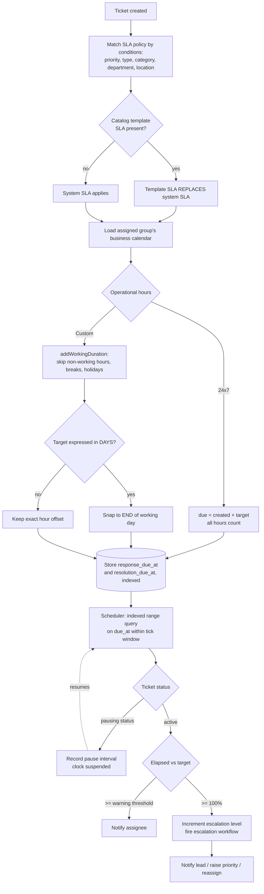
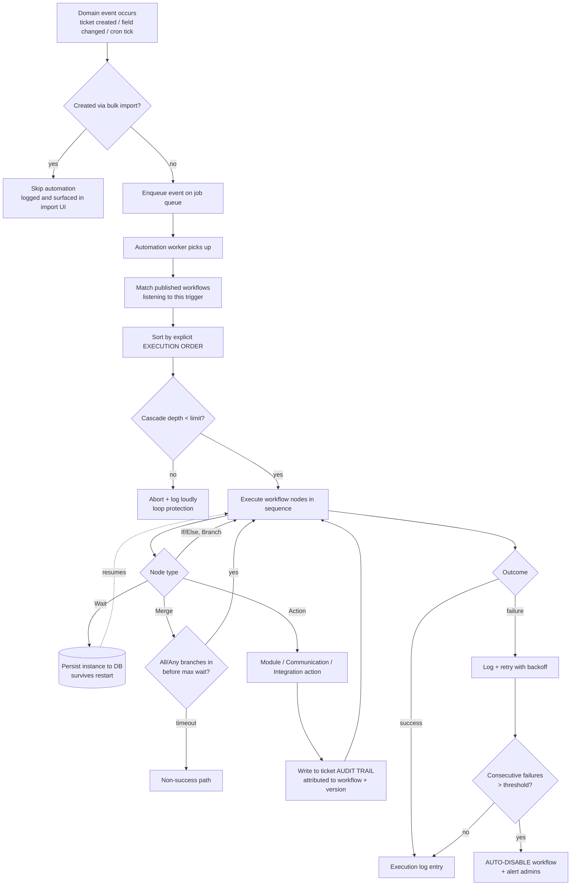
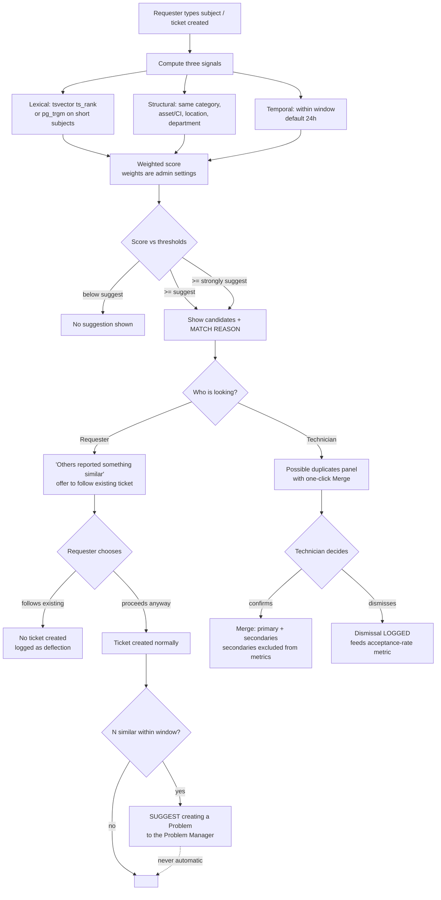
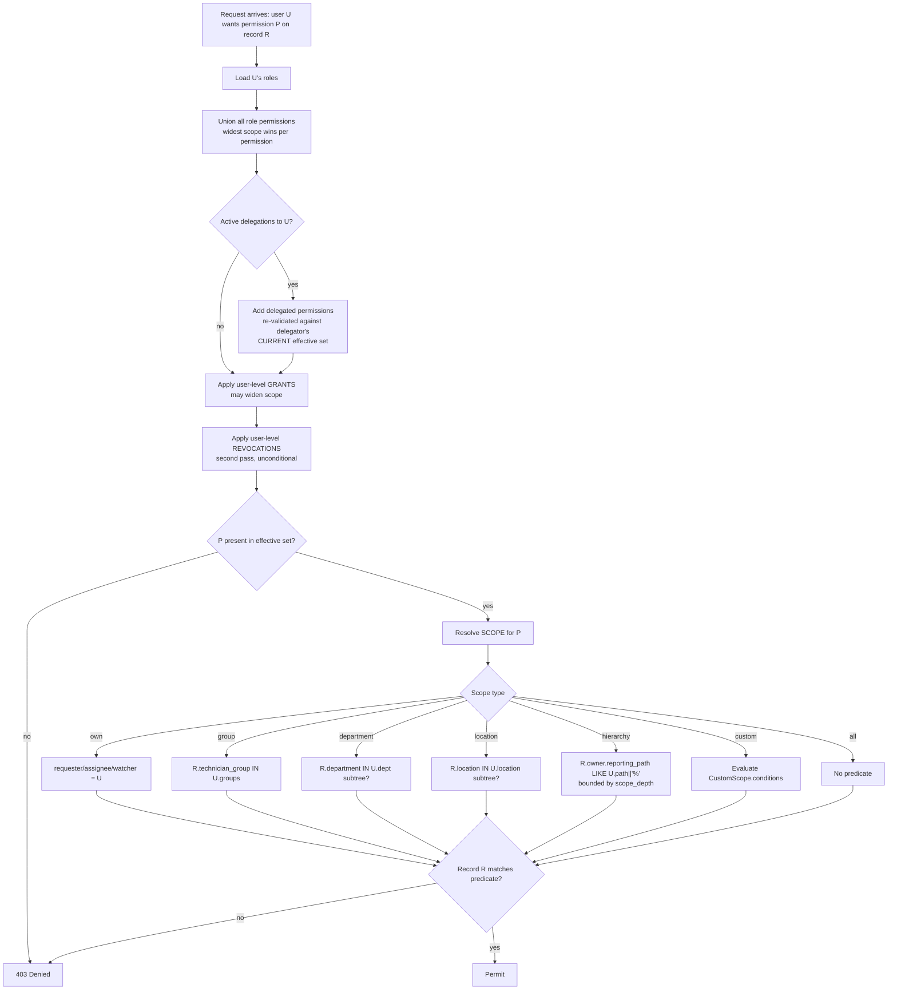
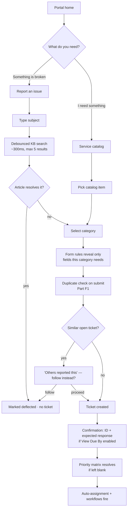

# Support Portal — Functional, Administration & Customization Reference

**Companion to:** _Support_Portal_Development_Constitution.md_
**Version:** 3.0
**Framework baseline:** ITIL 4 (with ITIL Version 5 forward-compatibility notes)
**Reference implementation studied:** Motadata ServiceOps
**Audience:** Claude Code, during implementation

---

## How to Use This Document

The **constitution** defines what to build and why. **This document** defines how it behaves at the field, rule, setting, and algorithm level — the specifics that cannot be correctly invented from first principles.

**Precedence.** Where the two conflict, the constitution governs; log the conflict as an ADR (Constitution Part XIV).

**Three standing rules that constrain every recommendation below:**

1. **No gimmicks.** Every feature here earns its place by removing manual work, preventing a class of error, or answering a question someone actually asks. Where a feature is genuinely optional it is marked **[Defer]** with the condition that would justify building it.
2. **Resource discipline.** This must run comfortably on one modest server for a small organization. Every intelligent behaviour in Part F is specified with a deterministic, CPU-cheap implementation — no model training, no vector database, no GPU, no per-request LLM call in the hot path. Cost notes are inline.
3. **Security, reliability, usability are not a later phase.** They are specified inside each part, not bolted on at the end.

---

## Table of Contents

**Part A — Framework Alignment** · A1 ITIL 4 baseline · A2 ITIL v5 direction · A3 Practice-to-module map · A4 Deliberate non-implementations

**Part B — Core Concepts & the Ticket Object** · B1 Vocabulary · B2 Field groups · B3 Priority matrix · B4 Hierarchies · B5 States beyond Closed · B6 Bulk operations

**Part C — Service Management Modules** · C1 Incident · C2 Service Request & Catalog · C3 Problem · C4 Change · C5 Knowledge · C6 Tasks

**Part D — Service Level Management**

**Part E — Automation & Workflow Engine**

**Part F — Applied Intelligence**

**Part G — Administration Manual**

**Part H — Customization Framework**

**Part I — Access Control & Security**

**Part J — Interface Specification (UI/UX)**

**Part K — Reporting & Service Management**

**Part L — Reliability, Performance & Operations**

**Part M — Integrations & Channels**

**Part N — Explicit Exclusions**

**Part O — Implementation Checklist**

**Part P — Sources**

---

# PART A — FRAMEWORK ALIGNMENT

## A1. ITIL 4 as the Operating Baseline

ITIL 4 replaced ITIL v3's process-centric lifecycle with a value-centric operating model: the **Service Value System (SVS)**, the **Service Value Chain (SVC)**, **four dimensions**, **seven guiding principles**, and **34 practices** — a shift in philosophy from rigid processes to adaptable practices, aligned with Agile and DevOps ways of working.

**The seven guiding principles, and what each obliges this build to do:**

| Guiding principle                      | Concrete obligation in this system                                                                                                   |
| -------------------------------------- | ------------------------------------------------------------------------------------------------------------------------------------ |
| **Focus on value**                     | Every metric surfaced must answer a question someone acts on. No vanity dashboards.                                                  |
| **Start where you are**                | Ship with seeded defaults (statuses, priorities, SLAs, roles, categories) so nobody configures from an empty screen.                 |
| **Progress iteratively with feedback** | CSAT, article feedback, and automation execution logs are feedback channels — built in Phases 1–3, not "later".                      |
| **Collaborate and promote visibility** | Audit trails, work logs, watchers, collaborators, and the shared change calendar. Automation actions must appear in the audit trail. |
| **Think and work holistically**        | One ticket object, one automation engine, one notification system — never per-module reimplementations.                              |
| **Keep it simple and practical**       | The anti-gimmick rule. A feature needing a paragraph of justification probably shouldn't ship.                                       |
| **Optimize and automate**              | Optimize the process first, then automate. Automation over a broken workflow just breaks faster.                                     |

**The four dimensions** map onto: _Organizations & People_ → roles, groups, departments (G3); _Information & Technology_ → data model and integrations (B, M); _Partners & Suppliers_ → vendor/UC handling (D1); _Value Streams & Processes_ → the workflow engine (E).

**Service Value Chain activities and where they live:** _Engage_ → self-service portal and multi-channel intake; _Deliver & Support_ → Incident and Request modules; _Improve_ → Problem management, CSAT, reporting; _Design & Transition_ → Change enablement. _Plan_ and _Obtain/Build_ sit outside a support portal's remit.

## A2. ITIL Version 5 — Direction of Travel

**Status.** ITIL Version 5 was announced in early 2026, with publications and certification modules rolling out through the year; ITIL 4 remains the practical baseline. Version 5 builds on ITIL 4 rather than replacing it — SVS, guiding principles, and the four dimensions carry forward.

**What matters to this build:**

- **Responsible AI governance.** Version 5 adds explicit guidance on adopting AI responsibly, including governance and risk management, with a dedicated AI-governance module. This directly shapes Part F: every intelligent behaviour must be **explainable, overridable, logged, and switch-off-able**. That is a framework requirement, not a nicety.
- **Unified product-and-service lifecycle.** Version 5 treats products and services as two aspects of one solution.

**Instruction:** build to ITIL 4. Accommodate Version 5's direction where it is cheap now — specifically (a) every automated or inferred decision stores a reason and permits human override, and (b) the catalog item model must not assume "service" excludes "product", since the catalog already fulfils hardware requests.

## A3. Practice-to-Module Map

| ITIL 4 practice                  | Module   | Phase   | Notes                                                                |
| -------------------------------- | -------- | ------- | -------------------------------------------------------------------- |
| Incident Management              | C1       | P0      | Core                                                                 |
| Service Request Management       | C2       | P0      | Core, with Service Catalog                                           |
| Service Desk                     | C1+C2+J1 | P0      | Realized through modules, not a separate module                      |
| Knowledge Management             | C5       | P1      | Deflection engine                                                    |
| Service Level Management         | D        | P1      | SLA/OLA                                                              |
| Service Configuration Management | B, G7    | P1      | Lightweight CMDB: linking only                                       |
| Problem Management               | C3       | P2      |                                                                      |
| Change Enablement                | C4       | P2      | Light-touch                                                          |
| Continual Improvement            | K        | P2      | Via reporting, CSAT, problem trends                                  |
| Monitoring & Event Management    | M5       | P3      | Integration hook only — we consume events, we don't monitor          |
| Workforce & Talent Management    | G3       | Partial | Only assignment-relevant parts: groups, support levels, availability |
| Supplier Management              | D1 (UC)  | Partial | We record vendor commitments; we don't manage suppliers              |
| Information Security Management  | I        | P0→     | Built into the system, not a module                                  |

## A4. ITIL Practices Deliberately Not Implemented

Most of the 34 practices are organizational disciplines, not software features; building modules for them is exactly the bloat this project avoids.

**Not implemented:** Strategy Management · Portfolio Management · Architecture Management · Project Management · Risk Management as a register (change-level risk _is_ captured) · Financial Management · Measurement & Reporting as a discipline (reports themselves exist) · Organizational Change Management · Service Continuity · Capacity & Performance Management · Availability Management · IT Asset Management full lifecycle · Deployment & Release Management · Software Development & Management · Infrastructure & Platform Management · Service Validation & Testing · Service Design · Business Analysis · Relationship Management.

Any of these entering scope later arrives through an ADR, not quiet absorption.

---

# PART B — CORE CONCEPTS AND THE TICKET OBJECT

## B1. Vocabulary

| Term                     | Meaning in this build                                                                                                     |
| ------------------------ | ------------------------------------------------------------------------------------------------------------------------- |
| **Request**              | The umbrella record. Subtypes **Incident** and **Service Request**. One table, one detail page, one `type` discriminator. |
| **Incident**             | Unplanned interruption or quality reduction. Goal: restore service.                                                       |
| **Service Request**      | Planned, standard, often pre-approved ask. Goal: fulfil a need.                                                           |
| **Problem**              | Cause of one or more incidents. Goal: permanent elimination.                                                              |
| **Change**               | Planned addition/modification/removal affecting services. Goal: controlled risk.                                          |
| **Task**                 | A unit of work inside a ticket (or standalone), separately assignable.                                                    |
| **Requester**            | End user raising tickets.                                                                                                 |
| **Technician**           | Agent working tickets.                                                                                                    |
| **Technician Group**     | A team a ticket can be assigned to; a technician may belong to several.                                                   |
| **Support Level (Tier)** | Technician attribute used for escalation and assignment filtering.                                                        |
| **Source**               | Channel the ticket arrived through. Metadata on the ticket, never a separate data path. `Source is changed` is a trigger. |
| **Watcher**              | User subscribed to a ticket's activity without owning it.                                                                 |
| **Collaborator**         | Tracked participant beyond requester and assignee.                                                                        |
| **Scenario**             | A saved bundle of actions a technician fires manually on a ticket.                                                        |
| **Workflow**             | An automated trigger → logic → action process.                                                                            |
| **Form Rule**            | Conditional field behaviour on a form.                                                                                    |
| **Custom Rule**          | A compliance gate blocking a transition unless conditions are met.                                                        |
| **Service Model**        | A state-transition model auto-advancing status when conditions match.                                                     |

**Critical modelling decision.** Incident and Service Request share one table with a type discriminator, and **conversion between them is a first-class operation** — the reference product exposes `Converted To Incident` and `Converted To Service Request` as trigger events. Misclassification at intake is routine; build conversion in Phase 1.

## B2. Field Groups on a Request

| Group              | Fields                                                                                                                          |
| ------------------ | ------------------------------------------------------------------------------------------------------------------------------- |
| **Identity**       | ID, Subject, Description (rich text), Type, Source, Tags                                                                        |
| **Classification** | Category (multi-level), Impact, Urgency, Priority, Support Level                                                                |
| **Ownership**      | Requester, Assignee, Technician Group, Department, Location, Watchers, Collaborators                                            |
| **Time**           | Created At, First Response Due, Resolution Due (Due By), First Responded At, Resolved At, Closed At, Estimated Time, Time Spent |
| **Resolution**     | Diagnosis, Solution, Resolution Notes, Closure Code                                                                             |
| **Linkage**        | Linked Assets/CIs, Linked Problem, Linked Change, Merge Parent/Children, Tasks, Approvals, Attachments                          |
| **Escalation**     | Response Escalation Level, Resolution Escalation Level                                                                          |
| **Audit**          | Audit trail, work logs, conversation threads                                                                                    |

**Escalation is a level counter, not a boolean.** Both response and resolution escalation levels are ticket fields incrementing as escalation progresses, and both are trigger events. A `breached` boolean cannot express "escalated twice, now with the team lead".

## B3. Priority Matrix — exact behaviour

Priority is **derived, not typed**:

- **Impact** = blast radius: `On User` → `On Department` → `On Business`
- **Urgency** = required speed: `Low`, `Medium`, `High`, `Urgent`
- The **Priority Matrix** is an admin-editable grid, Impact as rows × Urgency as columns, each cell yielding a Priority
- **It fires only when Priority is left blank at creation.** An explicitly set priority is never overridden

Example: Urgency = Medium, Impact = On Business → Priority = High.

**Implementation.** Store as `(impact_id, urgency_id) → priority_id`; evaluate in `resolvePriority()` called on create when `priority_id IS NULL`. Unit-test that a manually-set priority survives a subsequent impact change — the case implementations get wrong.

## B4. Classification Hierarchies

| Hierarchy      | Depth                                         | Purpose                                                                                                                                     |
| -------------- | --------------------------------------------- | ------------------------------------------------------------------------------------------------------------------------------------------- |
| **Category**   | Multi-level (`Category > Subcategory > Item`) | Routing, reporting, KB matching                                                                                                             |
| **Department** | Up to 5 levels                                | Ticket/user classification, workflow conditions, requester groups, department-scoped reports and business hours                             |
| **Location**   | N-level                                       | Geographic classification — and **doubles as a security filter**: technicians of one location can be restricted to that location's requests |

All three are self-referencing trees. Implement once with a shared tree helper (materialized path) plus a configurable depth guard — not three bespoke implementations. All three support **bulk import**, **reordering**, and use as automation conditions.

## B5. States Beyond Closed

Three states that are **not** Closed and must be modelled distinctly:

- **Spam** — noise removed from queues. Excluded from SLA timers, CSAT, and operational metrics.
- **Archived** — retired from active lists, retained for retention and historical reporting. Excluded from active workload (including Smart Balance load, F2).
- **Merged (secondary)** — folded into a primary. Excluded from volume counts to avoid double-counting.

Failing to exclude these produces silently wrong SLA compliance and workload numbers. Encode the exclusions in one `isOperationallyActive()` predicate used everywhere, not repeated per query.

## B6. Bulk Operations

One endpoint: `POST /requests/bulk` with `ids[]`, `action`, `payload`.

**Actions:** Update common fields · Merge · Claim · Assign · Resolve · Close · Mark as Spam · Archive · Restore · Delete (archived only) · Add Solution · Set Status / Priority / Urgency / Impact / Category / Location / Source / Department · Attach File · Add Tags.

**Safety requirements — these matter more than the feature itself:**

- **Permission-checked per record**, not once per batch. Selecting 200 tickets affects only those the user may edit; the response reports succeeded / skipped / failed with reasons.
- **Transactional per record, not per batch** — one failure must not roll back 199 successes.
- **Individual audit entries** per affected ticket, tagged with a shared `bulk_operation_id` so the batch can be reviewed as a unit.
- Above a configurable threshold, runs **asynchronously via the job queue** with progress in the Jobs tray (J2), never synchronously in the request cycle.

---

# PART C — SERVICE MANAGEMENT MODULES

## C1. Incident Management

### C1.1 Lifecycle

**Phase 1 — Detection & Recording.** Intake: technician console (including on behalf of a user), self-service portal, email-to-ticket, chat, messaging platforms, API. At creation, surface matching knowledge articles and similar past tickets **before submission** (F3) — the highest-leverage deflection point in the system.

**Phase 2 — Investigation & Diagnosis.** Categorize → prioritize (B3) → assign (auto or manual, to technician or group) → investigate using logs, diagnostics, and requester follow-up, recording findings in `Diagnosis`.

**Phase 3 — Resolution & Closure.** Apply fix → Resolved → requester confirms or reopens → notifications at milestones → CSAT on close → trends feed reporting and Problem Management.

### C1.2 Roles

- **End User** — reports accurately, confirms resolution.
- **Service Desk Analyst (L1)** — first contact; logs, diagnoses, resolves at first line, escalates beyond scope.
- **Incident Manager** — owns the process during major incidents: coordination, communication, SLA compliance, post-incident review.

### C1.3 Capabilities

| Capability                 | Behaviour                                                                                                                                                                    |
| -------------------------- | ---------------------------------------------------------------------------------------------------------------------------------------------------------------------------- |
| **Merge**                  | Fold duplicates into a primary. Produces `Marked as Primary Merged Request` / `Marked as Secondary Merged Request`, both trigger events. Detection: F1.                      |
| **Split**                  | One ticket containing several distinct issues becomes several, each inheriting requester and source.                                                                         |
| **Tasks**                  | Sub-work assignable to other technicians/teams (C6).                                                                                                                         |
| **Asset/CI linking**       | Attach the affected item; the technician then sees that item's full incident and change history — a documented, substantial diagnosis accelerator.                           |
| **Work logs**              | Time-tracked internal entries, distinct from user-visible replies.                                                                                                           |
| **Conversation threading** | Public replies vs internal notes, visually distinct and permission-separated.                                                                                                |
| **Watchers**               | Notify interested technicians who don't own the ticket.                                                                                                                      |
| **Collaboration**          | Add participants beyond requester/assignee; `Collaboration is added` is a trigger.                                                                                           |
| **Audit trail**            | Every action, immutable, including automation-driven ones.                                                                                                                   |
| **Major Incident**         | Distinct expedited handling: escalation path, named coordinator, proactive broadcast (portal announcement banner), mandatory post-incident review creating a linked Problem. |

### C1.4 Boundary Rules

Encode as UX guidance and validation — these are the distinctions users get wrong:

- **Incident vs Problem** — restore service now (workaround acceptable) vs find and permanently eliminate the cause.
- **Incident vs Change** — reactive to an unplanned event vs proactive planned modification.
- **Incident vs Service Request** — something is broken vs something is wanted.

## C2. Service Request Management & Service Catalog

### C2.1 Lifecycle — seven stages

1. **Submission** — standardized catalog form capturing everything upfront (details, options, business justification), minimizing back-and-forth.
2. **Assessment** — validate completeness and categorization, determine priority. Automatable.
3. **Approval** — routed by cost/risk/sensitivity; one-click approve/reject from email or portal.
4. **Assignment** — to technician or fulfilment group by workload, skill, or location; may spawn dependent child tasks across teams.
5. **Fulfilment** — delivery work, tracked against SLA, requester informed.
6. **Closure** — requester confirms receipt; full history retained for audit.
7. **Review & Feedback** — automated satisfaction survey feeding catalog improvement.

### C2.2 The Service Catalog Template — ten configurable dimensions

A catalog item is **not just a form**. This is the most valuable structure to replicate: it makes each service independently governable without code.

| Dimension               | Behaviour                                                                                                                                                                                                                                                                                 |
| ----------------------- | ----------------------------------------------------------------------------------------------------------------------------------------------------------------------------------------------------------------------------------------------------------------------------------------- |
| **Form**                | Drag-and-drop builder over two palettes: **Custom Fields** (addable, renamable, removable, duplicable) and **System Fields** (addable/removable, **not renamable**; once placed, removed from the palette so they can't be duplicated). Fields reorderable, width expandable/collapsible. |
| **Workflow**            | Template-specific automation running **in parallel with** global workflows — both fire, each evaluating its own conditions. Design for concurrency, not override.                                                                                                                         |
| **SLA**                 | Template-specific SLA that **replaces** the system SLA for this template's tickets. Note the asymmetry with Workflow: SLA overrides, workflow parallels.                                                                                                                                  |
| **Approval Workflow**   | Template-specific chain. The generic admin-level approval workflow does **not** apply to service-item requests — the template's does.                                                                                                                                                     |
| **Tasks**               | Pre-defined tasks in **up to 15 sequential stages**; a stage must complete before the next activates. Manually added tasks don't disturb this thread. One stage visible at a time. This is how "New Employee Onboarding" fans out across IT, HR, and facilities.                          |
| **Scenario**            | Manually-triggered action bundles specific to this service, with conditions and access levels.                                                                                                                                                                                            |
| **Service Model**       | A **state-transition model**: From-State → To-State pairs with condition groups that auto-advance status (e.g. Open → In Progress when an assignee is set). One model per service.                                                                                                        |
| **Form Rules**          | Conditional field logic (H2).                                                                                                                                                                                                                                                             |
| **Email Notifications** | Template-specific set, selected from global active notifications then individually editable.                                                                                                                                                                                              |
| **Custom Rules**        | Compliance gates (H4) — e.g. block Resolved with no technician assigned.                                                                                                                                                                                                                  |
| **Print Template**      | Rich-text print layouts with placeholder insertion, separately definable for Technician Portal and Support Portal.                                                                                                                                                                        |

### C2.3 Approvals — full specification

**Two categories:**

- **Manual** — technician creates an ad-hoc approval and picks the approver. Permission-gated. For non-standard requests needing stakeholder input.
- **Automatic** — condition-matched workflow selects the chain when approval is requested.

**Structure:**

- Multiple **stages**, each with its own approver set
- Approvers are **individuals** or a **requester group** (all members become approvers)
- Each stage is **Unanimous** (all must approve, else rejected) or **Majority** (≥50% approve → approved; remaining approvers become irrelevant)
- **Stages are strictly sequential, top-down**, one active at a time. **Rejection at any stage rejects the entire approval**; stages below are skipped
- All stages are instantiated at initiation

**Edge cases — build these; they are where approval systems break:**

| Case                           | Required behaviour                                                                                                                                                |
| ------------------------------ | ----------------------------------------------------------------------------------------------------------------------------------------------------------------- |
| Sole approver deleted          | Approval no longer required                                                                                                                                       |
| One approver removed mid-chain | That level is skipped; proceeds to next                                                                                                                           |
| Final approver deleted         | Previous level's approver becomes final                                                                                                                           |
| **Referred Back**              | First-class state distinct from Pending/Approved/Rejected: "I need more information before deciding"                                                              |
| Ignore / Delete approval       | Permission-gated (`Ignore Approval`, `Delete Approval`); **both unavailable once an approver has acted**                                                          |
| Pre-approval / Skip            | Marks approved without routing; pre-approved items don't appear in the Approvals tab. **Guard: only permitted if no active approval workflow's conditions match** |
| Approver inaction              | Reminder cadence, then auto-reroute to an alternate after timeout — requests must never stall silently                                                            |
| Re-initiation after rejection  | Prior entries **marked Archived, not deleted** — decision history preserved                                                                                       |

**Design principle.** Approvals are **optional by default**; technicians can work and close tickets without one. Where approval must be mandatory, enforce it with a **Custom Rule** (H4) on the specific transition rather than making approval mandatory in the core flow. This keeps the common path fast and the controlled path controlled.

### C2.4 Catalog Governance

Catalog sprawl is the documented failure mode. Mitigations that are features rather than wishes:

- **Per-item usage analytics** (requests raised, last requested, average fulfilment time, CSAT) on the catalog admin list, so unused items are visibly unused
- **Enable/disable per item** without deletion, so retirement is reversible
- **[Defer]** scheduled "catalog health" report — worth building once the catalog exceeds roughly 30 items

## C3. Problem Management

### C3.1 Trigger Modes

- **Reactive** — a spike of similar incidents, or major incident fallout
- **Proactive** — trend analysis identifying weaknesses before incidents occur

### C3.2 Lifecycle

Identification → Categorization → Prioritization → **Analysis** (RCA; a **workaround** may be published to the KEDB while investigation continues) → **Resolution** (typically via a linked Change) → Closure (solution documented to the knowledge base; linked incidents updated).

### C3.3 Distinct Fields

`Symptoms` · `Investigation-Impact` · `Workaround` · `Root Cause` · `Solution` · `Known Error` (boolean) · `Nature of Problem` · `Business Service`

**Do not collapse Workaround and Solution.** The documented anti-pattern is mistaking a workaround for a resolution. Separate fields — plus a Custom Rule requiring Root Cause and Solution before closure — make the distinction structural rather than cultural.

### C3.4 Known Error Database

A problem flagged as Known Error carries a documented workaround that **auto-surfaces to technicians on matching incidents** (F3). This is the highest-value automation in the product: it converts investigation time into a lookup.

Automation can also **auto-create a problem when a threshold of similar incidents is reached** — see F1 for the clustering method, and F1.4 for why this must be a suggestion rather than a silent creation.

### C3.5 Roles & KPIs

Roles: Problem Manager (process owner) · Problem Analyst/Coordinator (day-to-day RCA) · Technical SMEs (per investigation).

KPIs: reduction in recurring incidents (**the primary signal**) · Known Errors created · average time to identify root cause · open problem backlog.

## C4. Change Enablement

### C4.1 Three Types

- **Standard** — low-risk, pre-approved, template-driven, often catalog-originated. Submission & Planning → Implementation → Review & Closure. Largely automatable.
- **Normal** — requires assessment and **CAB** approval before scheduling.
- **Emergency** — expedited approval; mandatory post-implementation review.

### C4.2 Stage Model and Locking

Stages: **Submitted → Planning → Approval → Implementation → In Review → Closed**.

Two behaviours to copy exactly:

- **Stage-scoped field locking.** Once a stage completes, specified fields lock. In the Approval stage only Technician, Assignee, and collaboration items stay editable — planning schedule and notes freeze. This prevents the plan being altered after people approved it: both a governance and an audit requirement.
- **Rejection re-entry.** A rejected change restarts from Submitted; on re-initiation prior approval entries are **marked Archived, not deleted**, preserving decision history.

### C4.3 Required Fields

Risk level · Impact · Change Type · Change Reason · **Rollout Plan** · **Backout Plan** · Target Environment · Schedule Start/End · Rollout Start/End · Change Manager · Change Implementer · Change Reviewer · linked Assets/CIs · originating Incident/Problem.

**A change with no backout plan is incomplete, not merely risky** — enforce with a Custom Rule on the transition into Approval.

### C4.4 Change Calendar

Shared visual schedule of upcoming and in-flight changes, surfacing conflicts and blackout windows before collision. Filterable by team, risk, and type. One of the few genuinely valuable calendar views in ITSM: it prevents a specific, expensive class of incident.

### C4.5 KPIs

Change success rate (implemented without causing an incident) · count of unauthorized/emergency changes (**a high number means the standard path is too slow — a process signal, not a system failure**) · change lead time · open RFC backlog.

## C5. Knowledge Management

### C5.1 Article Lifecycle

`Draft → Review/Approval → Published → (Scheduled) Expiry/Archive`, with **full version history and revert**.

### C5.2 Capabilities

**Authoring:** rich text (formatting, tables, lists, embedded images/video), attachments (logs, scripts, configs), **templates** standardizing article types ("How-To", "Troubleshooting Steps", "Known Error").

**Organization & discovery:** hierarchical folders of unlimited depth; tags and categories for faceted filtering; **full-text search across article bodies**; **contextual suggestions** to requesters while typing (keyed off subject keywords) and to technicians working a ticket.

**Governance:** granular role-based permissions on create/edit/approve/view, scoped **per folder**; approval workflow before publish; **scheduled publish and scheduled expiry** for time-sensitive content; **user feedback** (helpfulness + comment) routed to content owners.

**Visibility scopes:** Public (self-service) · Internal (technician-only) · Team-restricted.

### C5.3 The Feedback Loop That Makes This Work

A knowledge base decays unless authoring is a byproduct of resolution. Three cheap mechanisms:

1. **Create article from solution** — one click on a resolved ticket opens a pre-filled draft using the ticket's problem statement and solution.
2. **Insert article into reply** — inserting content into a response increments a usage counter.
3. **Usage and feedback analytics per article** — views, insertions, deflections (article viewed and no ticket subsequently raised in that session), helpfulness ratio. High views with low helpfulness identifies articles to fix. This is a sort on a table, not an analytics platform.

### C5.4 Cross-Module Integration

- **Incident** — suggest on creation; link to ticket; create article from solution
- **Problem** — document root causes, known errors, permanent solutions
- **Change** — attach implementation plans, backout procedures, post-change docs
- **Service Request** — link how-to and policy docs to catalog items for pre-submission context

## C6. Task Management

Tasks are units of work inside a ticket (or standalone), separately assignable, statused, and tracked.

**Types by origin:** Standalone · Request Task · Change Task.

**Fields:** Name, Assigned To, Task Type, Technician Group, Priority, Start/End Date, Notify Before, Estimated Time, Description, Status, Dependencies.

**Capabilities:** custom task forms and fields · task form rules · dependency tracking between tasks and parent modules · work logs and comments per task · bulk edit/assign/update · configurable **Task Types** and **Task Statuses**.

**Staged tasks** (from catalog templates, C2.2) are the important case: tasks grouped into sequential stages where a stage must complete before the next activates. This is what makes multi-team fulfilment work without a project module.

**Scope guard.** Tasks belong to tickets. Standalone tasks are permitted; **task hierarchies, Gantt charts, and portfolio rollups are not** — that is the project management module excluded in Part N.

---

# PART D — SERVICE LEVEL MANAGEMENT

## D1. Three Agreement Types

| Type    | Between                       | Purpose                                                                                                |
| ------- | ----------------------------- | ------------------------------------------------------------------------------------------------------ |
| **SLA** | Provider ↔ requester/business | The visible commitment: response time, resolution time, escalation on breach                           |
| **OLA** | Internal team ↔ internal team | Internal handoffs making the SLA achievable (e.g. Network diagnoses within 2h so the desk can meet 6h) |
| **UC**  | Provider ↔ external vendor    | Vendor commitments underpinning the SLA (e.g. hardware replaced within 24h)                            |

Implement SLA and OLA as one table with a `scope` discriminator. **[Defer] UC** until vendor contracts are formally tracked — for a small in-house desk it is usually a spreadsheet concern, and building it early adds a module nobody opens.

## D2. Structure of an SLA Policy

- **Conditions** matching tickets: priority, type, category, department/sub-department, location
- **Operational Hours Type**: 24×7 or a named business-hours calendar
- **Maximum Response Time** and **Maximum Resolution Time**
- **Escalation actions** on violation, defined separately for response and resolution
- **Escalation Levels** — response and resolution levels are ticket fields advancing as escalation progresses, and both are trigger events

Four default policies ship keyed to priority: Low / Medium / High / Urgent.

## D3. The Calculation — replicate exactly

The due date is the target duration added to creation time, **computed against the assigned technician group's working calendar** — not naive clock arithmetic. Holidays are subtracted.

Two worked examples from the reference documentation, both of which should become unit tests:

- **24×7 group, Low priority, 7-day target.** Created 1 Jan 10:00 → due **8 Jan 10:00**. All hours count.
- **Mon–Fri, 10:00–19:00 with a 1-hour lunch, Low priority, 7-day target.** Created 1 Jan 10:00 → due **10 Jan 18:00**. Weekends and lunch breaks are excluded, so seven _working_ days spans more calendar days — and because the target is expressed in days rather than hours, the due timestamp lands at **end of working day**, not at the literal 10:00 offset.

**Implementation.** Build a `BusinessCalendar` service handling working hours, breaks, holidays, and timezone, exposing `addWorkingDuration(start, duration, calendar)`. The second example above is precisely what catches a naive implementation.

**Clock pausing.** Decide and document which statuses pause the resolution clock (typically Pending-Customer and Pending-Vendor) and make it **per-policy configurable**. Store paused intervals explicitly so the SLA timeline can be reconstructed and explained, rather than storing only a running total.

## D3a. Due-Date Calculation — visual



**Worked examples that must become unit tests (D3):** 24×7, 7-day target, created 1 Jan 10:00 → due 8 Jan 10:00. Mon–Fri 10:00–19:00 with a 1-hour lunch, same target → due **10 Jan 18:00**, not 8 Jan 10:00.

## D4. Breach Behaviour

Violation fires the **escalation flow**, which is the same trigger → condition → action engine used everywhere else (Part E) — not a bespoke mechanism. Typical escalation actions: notify assignee → notify team lead → raise priority → reassign technician.

**Warning thresholds.** Fire a warning at a configurable percentage of elapsed target (80% is a sensible default) so escalation is preventive rather than forensic.

**Implementation note (resource-relevant).** Do **not** poll every open ticket every minute. Store `response_due_at` and `resolution_due_at` on the ticket, index them, and have the scheduler query only tickets whose next threshold falls within the current tick window. On a small deployment this reduces SLA checking from a full table scan per minute to an indexed range query returning a handful of rows.

---

# PART E — AUTOMATION & WORKFLOW ENGINE

This is the most reused subsystem in the product. SLA escalation, auto-assignment, approvals, and notifications are all **instances of one engine**. Build the engine once, generically; configure the four use cases on top. Building them separately is the single most expensive architectural mistake available here.

## E1. Two Workflow Types

- **Event-Based** — fires on a system event. Real-time reactive automation.
- **Periodic** — fires on a schedule (daily/weekly/monthly). Housekeeping, batch operations, recurring tickets.

## E2. Five Building Blocks

1. **Triggers** — define _when/why_; emit structured output data downstream nodes consume.
2. **References** — pass and transform data from earlier nodes or related records into later nodes (e.g. `Trigger > priorityId > id`). This is what makes workflows contextual rather than static, and it is the piece most often omitted from home-grown rule engines.
3. **Expressions** — an **Expression Builder** for conditions, calculations, and transforms using operators, functions, and variables, with design-time validation. Conditions authored either in a simple **Condition tab** or an advanced **Expression tab**.
4. **Flow-control nodes** — E4.
5. **Action nodes** — three families: **Module Actions** (update record, assign, create task, run approval workflow), **Communication Actions** (email, SMS, chat platforms — all sub-actions of one unified Notification node), **Integration Actions** (outbound HTTP request, execute script/plugin).

## E3. Configuration Contract

1. **Module Selection** — which module the trigger observes
2. **Workflow Type** — Event or Periodic
3. **Trigger (Event)** — the precise event (E5)
4. **Flow logic and action nodes** on a visual canvas
5. **Execution Order** — when multiple workflows listen to the same event, an explicit order prevents conflicts

**Build execution order from the start.** Retrofitting deterministic ordering onto a rule engine already in production is painful and produces a period where nobody can explain why tickets behave inconsistently.

**Lifecycle:** Design & Configure → **Test** → **Publish/Activate** → Execute → Maintain.

**Versioning.** Workflows are versioned; a live workflow being edited must not retroactively alter already-processed tickets. This is the same versioning principle as form versioning (Constitution Part III.2) — share one mechanism between them.

**Draft/publish separation is a reliability feature, not a convenience.** An admin must be able to edit a workflow without it half-executing mid-edit. Only published versions execute.

## E3a. Execution Pipeline — visual



## E4. Flow-Control Nodes

| Node        | Behaviour                                                                                                                                                                                 |
| ----------- | ----------------------------------------------------------------------------------------------------------------------------------------------------------------------------------------- |
| **If/Else** | Conditional branching on static or referenced values                                                                                                                                      |
| **Branch**  | Multi-path conditional split                                                                                                                                                              |
| **Wait**    | Pause for a dynamic duration, or until a specific date/time                                                                                                                               |
| **Merge**   | Synchronize parallel paths. Configurable **Merge Type** (e.g. `Wait For Any`), **Maximum Wait Based On** (e.g. Calendar Hours), **Maximum Wait Duration**, with a **Success output** path |
| **Loop**    | Iterate over a list of items                                                                                                                                                              |

**A merge that can time out needs an explicit non-success path.** Do not model merges as always-succeeding joins; the timeout branch is where "the approval never came back" gets handled.

**Resource guard on Loop and Wait.** Both create long-lived workflow instances. Cap concurrent in-flight workflow instances, cap loop iterations (a configurable ceiling, default around 100), and persist waiting instances in the database rather than holding them in memory — otherwise an application restart silently drops every pending Wait.

## E5. Trigger Catalog

Automation is only as expressive as its trigger list. This is the **required event vocabulary**, scoped to the support portal.

### Request Triggers (the critical set)

**Lifecycle:** Request is created · Incident is created · Service Request is created · Converted To Incident · Converted To Service Request · Request/Incident/Service Request is archived

**Field changes:** Category · Subject · Description · Impact · Priority · Urgency · Assignee · Technician Group · Status · Department · Location · Source · Vendor · Support Level · Tags updated · Approval Status

**Escalation:** Response Escalation Level is changed · Resolution Escalation Level is changed

**Communication:** When reply is sent by Technician · When reply is sent by Requester · When reply is sent by CC User · Note is added · Collaboration is added

**Resolution:** Solution is added · Diagnosis is added

**Handling:** Marked as Primary Merged Request · Marked as Secondary Merged Request · Spam is changed

> **Documented exception to replicate:** requests created via **bulk import** do **not** fire workflows. Without this carve-out, importing 5,000 historical tickets sends 5,000 assignment emails. Make the exception explicit and configurable, and surface it in the import UI so the admin knows automation was skipped.

### Problem Triggers (delta from Request)

Symptoms is updated · Workaround is updated · Root Cause is updated · Investigation-Impact is updated · Known Error is changed · Nature Of Problem is changed · Business Service is changed · Problem is created/archived

### Change Triggers (delta from Request)

Change Risk is changed · Change Type is changed · Change Reason is changed · Rollout Plan is updated · Backout Plan is updated · Planning-Impact is updated · Target Environment is changed · Schedule Start/End Date is changed · Rollout Start/End Date is changed · Change Manager / Implementer / Reviewer is changed · Change is created/archived

### Task Triggers

Task is created/archived · Task Status / Priority / Type / Assignee / User Group is changed · Task Start/End Date is changed · Subject/Description is changed

### User Triggers (needed for onboarding/offboarding automation — see F5)

User is created/archived · User Login · User Logout · User is Blocked / Unblocked / Restored · Converted to Technician · Converted to Requester · Marked as Verified User · Availability Status is changed · Do Not Disturb is changed · Department / Location / Contact No. / Logon Name / Name is changed

### Asset/CI Triggers (support-portal-relevant subset only)

Asset is created/archived · Status is changed · Used By updated · Managed By / Managed By Group is changed · Location is changed · Asset Condition is changed · Warranty Expiration Date is changed · Business Service is changed · CI is created/archived · CI Type / CI Group / Name is changed

## E6. Worked Example — the canonical routing workflow

Reproduced as a build target because it exercises trigger, branch, action, merge, and notification together:

> **Scenario:** on incident creation, High-priority incidents go to "Critical Incident Response"; everything else to "General Support Group". Either way, notify the assigned group.
>
> 1. Module: `Request`. Trigger: `Incident is created`.
> 2. **If/Else** node: condition `Priority is High` (direct) or `Trigger > priorityId > id` (reference).
> 3. **True path:** `Update Request` → Technician Group = Critical Incident Response.
> 4. **False path:** `Update Request` → Technician Group = General Support Group.
> 5. **Merge** node: Merge Type `Wait For Any`, Maximum Wait Based On `Calendar Hours`, Maximum Wait Duration `1 Hour`.
> 6. On the Merge **Success** output: `Send Email to Technician Group`.
> 7. **Publish**, then verify the resulting assignments appear in each incident's **Audit Trail**.

Step 7 is the acceptance criterion: **automation actions must be visible in the ticket audit trail**, attributed to the workflow that performed them — never silently applied.

## E7. Auto-Assignment — full algorithm

### E7.1 Candidate filtering (before strategy)

1. **Technician Group** — if set on the ticket, only its members are candidates
2. **Assignee already set** — auto-assignment only evaluates tickets with **no assignee**
3. **Roles and permissions** — with no group or assignee, candidates are all technicians who can access the ticket (even minimal edit privilege qualifies)
4. **Excluded list** — explicitly excluded technicians are never candidates
5. Optional flag: **Consider only Logged-in Technicians**

### E7.2 Three strategies, configurable per module

**Manual** — no automatic action; tickets await human triage.

**Round Robin** — cycle through candidates in order, wrapping at the end. Simple and fair by count, blind to effort.

**Smart Balance** — priority-weighted workload balancing:

- Each priority has a **priority value (P)**. A technician's **load = Σ(P × N)** across actively assigned tickets.
- On a new ticket, first compare candidates by **count of assigned tickets at equal-or-higher priority** than the new one; fewest wins.
- **Tie-break on lowest total load.**

_Worked example from the documentation:_ T1 load 60, T2 load 21, T3 load 28. A new **High** priority ticket arrives. Higher-or-equal-priority counts: T1=3, T2=1, T3=1. T2 and T3 tie on count, so lower total load wins → **assigned to T2**.

- **Recalculation policy (important for resource use):** load recalculates for a technician when a ticket is created/assigned or a technician is added/removed. Other affected technicians recalculate only if their load has not been updated **in the last 10 minutes** — a deliberate debounce. Copy this; naive recalculation of every technician on every ticket event is a real performance problem at even modest volume.
- Only **actively assigned** tickets count toward load (see B5 exclusions).
- Support Level interacts: Tier 1 is the default on new tickets, and Smart Balance only functions for Requests if a Support Level is set on the technician. Higher tiers are manually assigned and excluded from auto-assignment.

### E7.3 Operational cautions to surface in the admin UI

- Auto-assignment applies **only to new tickets**; it never sweeps the existing open backlog.
- It should be configured **at setup time**; enabling it late leaves a pile of unassigned historical tickets.
- **A workflow or scenario configured to auto-assign overrides this setting — including when it is set to Manual.** Precedence must be explicit and documented in the UI, or admins will file bugs against correct behaviour.

## E8. Other Automation Surfaces

| Surface                        | Purpose                                                                                                                                                                                                                                                                                            |
| ------------------------------ | -------------------------------------------------------------------------------------------------------------------------------------------------------------------------------------------------------------------------------------------------------------------------------------------------- |
| **Scenario**                   | Manually-triggered action bundle a technician runs on a ticket via an Execute button. Configurable **Technician Access Level** and **Technician Group Access Level** so not every agent can run every scenario. For standardized multi-step responses that still need human judgement to initiate. |
| **Request/Incident Schedules** | Periodically create tickets from a template (weekly server health check, monthly access review).                                                                                                                                                                                                   |
| **Task Schedules**             | The same for standalone tasks.                                                                                                                                                                                                                                                                     |
| **Custom Script**              | Scripts running on Request/Change forms on create/edit, and invocable from form rules via `Run Custom Script`. **Security-critical — see I7.**                                                                                                                                                     |
| **Response Templates**         | Canned replies with placeholder insertion and optional attachments, selectable while replying; individually enable/disable-able. **Placeholders come from a fixed system list; users cannot invent new ones** — enforce that, since free-form placeholder syntax is an injection surface.          |
| **Notification Templates**     | Per-event, per-channel (email, SMS, in-app), with placeholder insertion, individually activatable. SMS templates have no subject line.                                                                                                                                                             |

## E9. Automation Observability (non-negotiable)

An automation engine nobody can debug becomes an automation engine nobody trusts, and then nobody uses.

**Required:**

- **Execution log** per workflow run: workflow, version, trigger event, target record, each node's outcome, final result, duration, error message on failure. Retained for a configurable window (30 days default), then rolled up to counts.
- **Per-workflow health view**: runs, success rate, average duration, last failure — visible on the workflow list, not buried.
- **Failure alerting to admins** (Constitution Article VII: fail safe, not silent). A workflow failing repeatedly must raise a visible admin notification, and after a configurable consecutive-failure threshold should **auto-disable itself** rather than continue failing silently against every ticket.
- **Dry-run/test mode** — evaluate a workflow against a chosen existing ticket and show what _would_ happen, without side effects. This single feature prevents most production automation accidents.
- **Loop protection** — an automation that updates a field which re-triggers the same automation must be detected and broken. Track a per-record automation-depth counter within a single event cascade; abort past a configurable depth (default 10) and log it loudly. Without this, one badly configured rule can generate unbounded work.

---

# PART F — APPLIED INTELLIGENCE

**Governing constraints for this entire part.** Every behaviour here is (a) deterministic or statistically simple, (b) computable on commodity hardware without a GPU or model training, (c) **explainable** — the system states why it made a suggestion, (d) **overridable** — a human can always disagree, (e) **logged** — decisions are auditable, and (f) **switch-off-able** per feature. This satisfies both the resource budget and ITIL Version 5's responsible-AI-governance direction (A2).

**The default posture is suggestion, not action.** The system proposes; a human disposes. Exceptions are explicitly marked, and each has a bounded blast radius.

## F1. Duplicate & Similar Ticket Detection (ticket merging)

### F1.1 The problem worth solving

When a shared service breaks, twenty people raise twenty tickets. Twenty technicians then investigate the same fault. Detection at intake collapses that into one investigation.

### F1.2 Method — PostgreSQL only, no external service

Combine three cheap signals into a score:

1. **Lexical similarity** on subject and description using PostgreSQL full-text search (`tsvector` + `ts_rank`), or trigram similarity (`pg_trgm`) for short subjects where full-text stemming underperforms. Both are native, indexed, and fast.
2. **Structural match** — same Category, same linked Asset/CI, same Location or Department. Structural agreement is a strong signal and costs a single indexed comparison.
3. **Temporal proximity** — within a configurable window (default 24 hours). An identical subject three months apart is recurrence, not duplication; that distinction matters because recurrence feeds Problem Management (C3) while duplication feeds merging.

Score = weighted sum, weights admin-configurable, with two thresholds: **suggest** and **strongly suggest**. Nothing merges automatically.

### F1.3 Where it surfaces

- **Requester, at creation** — "Others have reported something similar" with a link to follow the existing ticket instead of raising a new one. This is deflection, and the cheapest ticket is the one never created.
- **Technician, on the ticket** — a "Possible duplicates" panel listing candidates with the match reason ("same subject terms, same linked asset, within 2 hours") and a one-click **Merge** action.
- **Bulk triage** — during a major incident, select all candidates and merge into the primary in one action (B6).

### F1.4 Why merging must never be automatic

A wrong automatic merge destroys a distinct customer's issue inside someone else's ticket, and the requester experiences it as being ignored. That failure is expensive and hard to detect. **Suggest always; merge on human confirmation only.** The same logic applies to auto-creating a Problem from clustered incidents (C3.4): propose it to the Problem Manager, don't spawn records silently.

### F1.4a Detection and merge flow — visual



**The dashed edge is the important one.** Nothing on this diagram merges or creates records without human confirmation — a wrong auto-merge buries a distinct issue inside someone else's ticket, and the requester experiences it as being ignored.

### F1.5 Resource cost

One indexed full-text query plus one structural query per ticket creation, scoped to a time window. On a small-organization corpus this is single-digit milliseconds. No background training, no additional service.

## F2. Intelligent Routing

Covered algorithmically in E7. The "intelligence" here is **priority-weighted load balancing with a debounce** — deliberately statistical rather than predictive.

**Optional refinement, cheap and genuinely useful:** **category-affinity routing**. Maintain a rolling counter of `(technician, category) → resolved count, median resolution time` over a trailing window. When candidates tie under Smart Balance, prefer the technician with demonstrated affinity for that category. This is one aggregate table updated on resolution — no model, no training — and it converts an arbitrary tie-break into a competence-informed one.

**Guard rails that keep this from becoming unfair:**

- Affinity is a **tie-break only**, never a primary criterion — otherwise the person who once fixed a printer becomes the permanent printer person.
- Cap the affinity bonus so it cannot override workload balance.
- Make the affinity table **visible to team leads**, since it is also a skills-gap report.

## F3. Knowledge Deflection & Contextual Suggestion

### F3.1 Requester-side (highest value in the system)

As the requester types a subject, surface matching published, publicly-visible knowledge articles — keyed off subject keywords via the same full-text index used in F1. Debounce input (roughly 300ms) and cap results at three to five.

**Measure the outcome, or the feature is faith-based.** Log article-viewed-during-creation, and whether a ticket was subsequently submitted in that session. The ratio is the deflection rate, and it is the number that justifies knowledge investment.

### F3.2 Technician-side

On an open ticket, surface: matching knowledge articles, **matching Known Errors with documented workarounds** (C3.4), and similar resolved tickets with their solutions. One-click insert into the reply, which also increments article usage (C5.3).

### F3.3 Method

The same PostgreSQL full-text index, ranked, filtered by visibility scope and the requester's permissions. **[Defer]** semantic/vector search until the knowledge base exceeds several hundred articles _and_ measurement shows keyword search is genuinely missing matches — the infrastructure cost is real and the benefit at small corpus sizes is not.

## F4. Troubleshooting Assistance

Three tiers, deliberately in increasing order of cost. Build tier 1 and 2; treat tier 3 as optional.

**Tier 1 — Guided intake (deterministic, no intelligence required).** Conditional catalog and incident forms (H2) that ask the right follow-up questions based on category. "Printer not working" branches to printer-specific questions. This eliminates the most common cause of slow resolution — the first reply being a request for basic information. Cost: zero beyond the form-rules engine already being built.

**Tier 2 — Resolution memory (statistical, cheap).** For a ticket's category and matched keywords, surface the most frequent solutions applied to similar resolved tickets, ranked by frequency and recency. This is a grouped query over resolved tickets, not a model. It is effectively an automatically-maintained knowledge base covering the cases nobody wrote an article for.

**Tier 3 — [Defer] LLM-assisted drafting.** Summarizing a long ticket thread, or drafting a first-response suggestion. Genuinely useful, but it introduces an external dependency, per-call cost, latency, and a data-egress question that matters for a banking-adjacent environment. If built later: never in the hot path, always as an explicit technician-invoked action, never auto-sending, with the generated text clearly marked as a draft. Design the extension point now (an interface for a text-generation provider); build nothing behind it yet.

## F5. Intelligent User Handling

### F5.1 Lifecycle automation

The User trigger set (E5) makes user lifecycle automation possible without a separate module:

- **Onboarding** — `User is created` fires a Service Request from an onboarding catalog template, spawning staged tasks across teams (C2.2).
- **Offboarding** — `User is archived` or `User is Blocked` fires an access-revocation checklist and flags assets assigned to that user for return.
- **Department/Location change** — re-evaluates the user's requester group membership and, where configured, their ticket routing.
- **Requester → Technician conversion** — assigns the configured default role (G3) and triggers technician onboarding tasks.

### F5.2 Requester context on the ticket

Show, on every ticket, information the technician would otherwise go looking for: the requester's department, location, assigned assets, open ticket count, and recent ticket history. This is a join, not an inference — and it is the difference between a technician asking "what laptop do you have?" and already knowing.

### F5.3 VIP / sensitivity handling

Rather than a hardcoded VIP flag, use **user custom fields plus workflow conditions** (H1, E5). Any user attribute becomes a routing or SLA condition. This keeps a politically sensitive concept configurable and auditable rather than embedded in code.

### F5.4 Duplicate-user prevention

On user creation and LDAP/SCIM sync, match on email and on normalized name plus department, and warn on likely duplicates. Duplicate user records fragment ticket history, which quietly degrades every other feature in this part.

### F5.5 Availability-aware assignment

`Availability Status` and `Do Not Disturb` are user fields and trigger events; `Consider only Logged-in Technicians` is an auto-assignment flag (E7.1). Together these prevent the classic failure of assigning an urgent ticket to someone on leave. **[Defer]** full leave-calendar integration until there is an HR system to integrate with.

## F6. Anomaly and Trend Signals

Cheap statistics that answer real questions, all computable as scheduled aggregate queries:

- **Incident clustering** — N similar incidents within a window (reusing F1's similarity) suggests creating a Problem. Surfaced as a suggestion to the Problem Manager.
- **Volume anomaly** — today's ticket count for a category materially exceeding its trailing mean flags a possible emerging major incident. A simple standard-deviation check on a daily aggregate is sufficient; nothing more sophisticated is warranted at this scale.
- **Repeat-contact detection** — the same requester raising multiple tickets on the same asset or category in a short window signals an unresolved underlying issue, and is a better quality metric than reopen rate alone.
- **Aging backlog** — tickets with no activity for longer than a threshold, segmented by assignee and team. Boring, unglamorous, and the report team leads actually use.

**What we deliberately do not build:** predictive SLA-breach modelling, sentiment analysis, forecasting. At small-organization volumes these produce statistically meaningless output while consuming real resources and inviting misplaced confidence. The threshold-based warning in D4 delivers most of the benefit of breach prediction at a fraction of the cost.

## F7. Governance of Intelligent Features (ITIL v5 alignment)

Applies to everything in Part F:

| Requirement      | Implementation                                                                                                                                                                                          |
| ---------------- | ------------------------------------------------------------------------------------------------------------------------------------------------------------------------------------------------------- |
| **Explainable**  | Every suggestion displays its reason ("matched on subject terms and linked asset, within 2 hours")                                                                                                      |
| **Overridable**  | Every suggestion can be dismissed; dismissal is recorded                                                                                                                                                |
| **Logged**       | Suggestion shown, accepted, or dismissed — all auditable, enabling measurement of whether the feature actually helps                                                                                    |
| **Configurable** | Thresholds and weights are admin settings, not constants in code                                                                                                                                        |
| **Disableable**  | Each intelligent feature has an independent on/off switch                                                                                                                                               |
| **Bounded**      | No intelligent feature may take an irreversible action (merge, close, delete) without human confirmation                                                                                                |
| **Measured**     | Acceptance rate per feature is reported. A suggestion feature accepted under ~20% of the time is noise and should be retuned or removed — and this is the review that keeps the system honest over time |

---

# PART G — ADMINISTRATION MANUAL

The administration surface is what determines whether the organization can evolve the system without a developer (Constitution Article II). This part enumerates every admin area, its settings, and the behaviours that are easy to get wrong.

## G0. Admin Console Structure

Organize as a **flat, searchable grid of top-level tiles**, not a nested tree, with a search that highlights matching sub-tabs across all sections (searching "sms" highlights every section containing an SMS sub-tab).

**Adopt this pattern deliberately.** For a surface visited infrequently, flat plus searchable beats deep plus hierarchical, because nobody remembers the menu tree between visits. Deep admin trees are a leading cause of "the system can do that, but nobody could find it."

**Permission-driven rendering.** Admin sub-modules render only when the role grants them — with "Manage SSO Configuration" disabled, the SSO menu simply does not appear. Note also that some sub-modules deliberately **share a single permission** (Technicians and Technician Groups share one). Decide these groupings intentionally rather than accumulating them.

**Admin sections in scope:** Automation · Users · Organization · Support Channels · Request Management · Service Catalog · Problem Management · Change Management · Knowledge Management · Task Management · User Survey · Security.

## G1. Organization Settings

### G1.1 Account Details

Company name, email, contact number, employee count, registered address, description, website, **timezone**, base currency, plus multi-currency support where needed.

Timezone is load-bearing: it is the default for business-hours calendars, report boundaries, and every displayed timestamp. Store all timestamps in UTC; render in the user's timezone where set, falling back to the organization's.

### G1.2 Branding

Logo, colour theme, portal name, favicon, email header/footer. Applied via CSS custom properties at runtime so theming requires no rebuild. Support portal branding is configurable independently of the technician console.

### G1.3 Departments

Hierarchical to **five levels**. Supports add, edit, delete, **bulk import**, and **reorder**. Departments classify tickets, assets, and users; act as workflow conditions; define requester groups; scope reports; and can carry **their own business hours**.

**Deletion guard:** a department in use by users, tickets, or automation conditions must not hard-delete. Offer deactivate-and-reassign instead, and show the usage count before the action.

### G1.4 Locations

**N-level** hierarchy, assignable to users and tickets. Beyond classification, locations act as a **security filter** — technicians of one location can be restricted to that location's requests (see I3). This dual role means location changes have access-control consequences and must be audited.

### G1.5 Business Hours

Two categories:

- **24×7** — no breaks or weekly offs; the team is always operational.
- **Custom** — office shifts, breaks, weekly offs, and **public holidays**.

Each calendar carries a name, description, and **timezone**. Separate working hours can be defined **per department**. Holidays are subtracted from SLA calculations (D3).

**Requirements:** annual holiday sets should be copyable year to year (nobody wants to re-enter 25 holidays each January), and a calendar in use by an active SLA policy must warn before edit — changing a calendar silently changes every live due date computed from it.

### G1.6 Priority, Impact, Urgency Value Sets

Admin-manageable value lists feeding the priority matrix (B3). Each carries a name, display order, and colour used consistently across list views, badges, and reports. Deleting a value in use requires remapping.

### G1.7 System Preferences

Application accessibility toggle (enables the font-size control, J2) · date/time display format · default landing page per role · session and idle timeouts (I5) · attachment size and permitted MIME types (I6) · data retention windows per entity (I9).

### G1.8 Privacy Settings

User consent capture on first login, with re-consent triggered when the policy is updated. Consent state is stored per user with a timestamp and policy version. Where consent is enabled, the login flow must block until granted.

## G2. Support Channel Administration

### G2.1 Email

Configured as **two separate server connections** plus a preferences group:

- **Outgoing** — the address the system sends from (notifications, announcements)
- **Incoming** — the monitored mailbox converting inbound mail into tickets
- **Email Preferences** — conversion behaviour, default type/category for email-originated tickets, reply-handling rules

Protocols: **SMTP, IMAP, POP3, MAPI**. **OAuth-based setup for Microsoft 365** is a distinct connector path (sign-in, tenant consent), not an SMTP variant — build it as its own connector type, since modern providers increasingly require it and password-based mail auth is being retired.

**Email-to-ticket requirements:**

- Thread matching by ticket ID in the subject **and** by message references header, so replies attach to the right ticket rather than opening new ones
- **Loop protection** — ignore auto-replies, out-of-office, and bounce messages by header inspection. An unguarded email-to-ticket integration in a loop with an autoresponder generates thousands of tickets overnight; this is a real and common outage
- Attachment extraction with size and type limits (I6)
- An **email delivery/failure audit** with per-message status, plus a user preference to be notified of delivery failures
- Spam handling that routes to the Spam state (B5) rather than creating noise in queues

### G2.2 Support Portal Settings

The requester-facing control surface. Each toggle maps to a server-side permission check, never merely a hidden UI element.

**Incident creation**

- Allow Requester to create Incident
- Allow **Guest** Requester to Report a Request (available only if the above is on)
- Allow Requester to Create Incident **on Behalf of Other Requester** (makes the Requester field editable)

**Visibility**

- Allow Requester to View Request **Due By** — must surface consistently in the detail page, list columns, list search conditions, **and** export column list. Applying it to only some of the four is a common and confusing bug
- Allow Requester to Access **Solution**
- Allow Requester to Access **Audit Trail** (adds an Audit Trail tab to their ticket view)

**Ticket actions**

- Allow Requester to **Close** Request
- Allow Requester to **Submit Feedback** (post resolve/close, per Feedback Settings)
- Allow Requester to **Reopen Resolved** Request — with **Grace Period**: `Unlimited` or `N Days`, after which reopen is disabled
- Allow Requester to **Reopen Closed** Request — same model, **configured independently**
- **Mandate comment to Reopen** Request

**Service catalog**

- Allow Requester to Access Service Catalog
- Allow **Guest** Requester to Request for Service
- Allow Requester to Request Service **On Behalf Of** Other Requester

**Assets / CIs**

- Allow Requester to Access My Assets / My CIs
- Allow Requester to **Link Asset / Link CI** to a request
- Allow Requester to link asset/CI **of another requester**
- **Auto-Link Requester Assets/CIs** — automatically attaches the logged-in requester's items (for service requests this must additionally be configured per catalog item)

**Knowledge**

- Allow Requester To Access Knowledge
- **Show Suggested Knowledge while creating new Request** (F3.1)

**Approvals**

- Allow Requester To Access My Approvals
- Show Approvals tab in Request Detail View

**Registration**

- Allow Self Registration → Registration Type: `Allow Everyone` or `Set of Domains` (email-domain allowlist)

> **Design lesson worth acting on.** Notice how many toggles are _pairs_ — an action, plus an "on behalf of another user" variant, plus a guest variant. Build the permission model to express **`action × subject-scope (self / other / guest)`** rather than adding boolean columns one at a time. Doing this once at the start collapses roughly forty settings into a coherent matrix; doing it later means migrating all of them.

### G2.3 Chat

Live chat between requesters and technicians, with a technician-side chat console (J2), routing to available agents, and conversion of a chat into a ticket preserving the transcript.

### G2.4 Virtual Agent / Messaging Platforms

Per-platform configuration (M4). Keep **inbound ticket creation** and **outbound notification delivery** as separate configuration entries even on a shared platform — an organization may want outbound Slack notifications without accepting inbound ticket creation there.

## G3. User Administration

### G3.1 Technicians and Requesters

Separate management surfaces sharing a permission. Each user carries: name, email, logon name, contact, department, location, role, groups, support level, availability status, do-not-disturb, verified flag, and custom fields.

**Operations:** create · edit · **bulk import** (CSV and LDAP) · block/unblock (with a recorded **Blocked Reason**) · archive/restore · **convert requester → technician** (assigning the configured default role) · convert technician → requester.

### G3.2 User Form

System and custom fields capturing additional user detail. **These fields are usable in automation conditions** (E5, F5.3) — which is what makes VIP handling, location-based routing, and department-driven approval chains configurable rather than hardcoded.

### G3.3 Technician Groups and Requester Groups

- **Technician Groups** — teams for assignment and OLA scoping; a technician may belong to several. Each group carries its own **business hours**, which is what makes SLA calculation team-aware (D3).
- **Requester Groups** — collections of requesters, definable by department, used for approval routing and catalog visibility scoping.

### G3.4 Roles

Two classes:

- **Predefined (system) roles** — shipped, **cannot be deleted**, and their **permissions cannot be edited** (a deliberate lockout guard). Membership _can_ still be changed.
- **Custom roles** — admin-created, fully editable and deletable.

**Management surface:** search by name · filter by All / Predefined / Custom (search and filter combine) · **Duplicate** an existing role as a starting point · assign users via a Users tab on the role itself · **Set as Default** — the role auto-assigned when a requester is converted to a technician, with a documented fallback if none is set.

**Reference default role set** (a useful completeness checklist, scoped to this build): Super Admin · Service Desk Technician (Request + Problem + Change) · Request Specialist · Problem Specialist · Change Specialist · Knowledge Manager · Dashboard Viewer · Report Viewer · Requester.

### G3.5 Identity Configuration

LDAP/Active Directory · SSO (SAML, OIDC) · SCIM provisioning · Custom Scopes. Full detail in Part I.

## G4. Request Management Administration

| Area                    | Purpose                                                                                                                                                                                       |
| ----------------------- | --------------------------------------------------------------------------------------------------------------------------------------------------------------------------------------------- |
| **Request Form**        | Field layout for incidents, system and custom fields, **User Fields Mapping** (auto-populate ticket fields from the requester's user record)                                                  |
| **Request Form Rules**  | Conditional field logic (H2)                                                                                                                                                                  |
| **Priority Matrix**     | Impact × Urgency → Priority grid (B3)                                                                                                                                                         |
| **Statuses**            | Custom statuses beyond the defaults, each flagged open/closed/terminal, with colour and display order. The open/closed flag drives SLA clock behaviour and queue filters — it is not cosmetic |
| **Categories**          | Multi-level category tree, importable and reorderable                                                                                                                                         |
| **Response Templates**  | Canned replies with fixed-list placeholders and optional attachments                                                                                                                          |
| **Custom Rules**        | Compliance gates on transitions (H4)                                                                                                                                                          |
| **Print Templates**     | Print layouts with placeholder configuration, separately for technician and support portals                                                                                                   |
| **Request Templates**   | Pre-filled request forms for common issues, selectable at creation and resettable to default                                                                                                  |
| **Request Preferences** | Default support level, default type, reopen behaviour, spam handling, quick-create toggle                                                                                                     |

## G5. Service Catalog Administration

Service categories · catalog items built from templates with all ten dimensions (C2.2) · per-item visibility scoping by requester group or department · enable/disable per item · per-item usage analytics (C2.4).

## G6. Problem, Change, Knowledge, and Task Administration

Each module mirrors the Request Management pattern: **form + form rules + statuses + categories + custom rules + notifications + templates**. Building this as one parameterized configuration framework rather than four near-duplicate admin sections is the single largest code-saving decision in the administration layer — and it means a new module type inherits full configurability for free.

Module-specific additions:

- **Change** — change types, risk values, reasons, CAB definition, blackout windows
- **Knowledge** — folder tree, article templates, approval workflow, publish/expiry defaults
- **Task** — task types, task statuses, task forms

## G7. Asset / CI Administration (lightweight)

Asset types with type-specific custom attributes · asset statuses · CI types and relationship types · CSV import/export · **[Defer]** discovery agents, barcode/QR, movement approvals, depreciation (Part N).

Only what is needed for the ticket-linking value described in C1.3 is in scope.

## G8. User Survey / CSAT Administration

Survey builder (question set, rating scale, optional free text) · trigger conditions (on resolve, on close, sampled percentage) · frequency capping so the same requester isn't surveyed on every ticket · results feeding K2.

**Frequency capping is the setting that determines whether CSAT data is trustworthy.** Surveying every ticket produces fatigue and a response set biased toward the annoyed; a configurable cap (for example, at most one survey per requester per week) yields better data and fewer complaints.

## G9. Security Administration

Audit logs (configuration, email, operation) · active user sessions with forced revoke · password and lockout policy · IP allow/deny lists · MFA enforcement per role · API key management. Full detail in Part I.

## G10. Administrative Safety Requirements

These apply across every admin surface and prevent the most damaging class of self-inflicted outage:

- **Every admin change is audited** — actor, timestamp, before/after diff, IP.
- **Deletion guards everywhere.** Any entity referenced by tickets, users, or automation must warn with a usage count and offer deactivation instead of deletion. Silent cascading deletes in an ITSM configuration are unrecoverable in practice.
- **Configuration export/import** for workflows, form rules, SLA policies, and catalog templates — enabling a staging-to-production promotion path and serving as configuration backup.
- **Preview before apply** wherever a change affects existing records (SLA edits, calendar edits, workflow edits): state how many open tickets the change would affect.
- **No admin action may lock out all administrators.** Enforce at minimum one active user holding full admin permissions; block the operation that would violate it.

---

# PART H — CUSTOMIZATION FRAMEWORK

Customization is the practical expression of Constitution Article II. This part specifies the five mechanisms, in ascending order of power, and — importantly — when to use which.

**The selection rule.** Reach for the least powerful mechanism that solves the problem: **Custom Fields** for new data → **Form Rules** for field behaviour → **Service Model** for status transitions → **Custom Rules** for compliance gates → **Workflows** for cross-record process automation. Using a workflow where a form rule suffices makes the system slower and harder to reason about.

## H1. Custom Fields

**Types:** Text · Text Area · Number · Date · Datetime · Dropdown (single) · Multi-select · Checkbox · Radio · User Picker · Asset Picker · Attachment.

**Attachable to:** Request (per type and per catalog item) · Problem · Change · Task · Asset · **User**.

**Metadata:** label, help text, required flag, default value, validation (regex/range), display order, width, visibility scope (technician-only vs requester-visible).

**Storage.** EAV-style `CustomFieldValue` keyed by `(field_id, entity_type, entity_id)` so adding a field never requires a schema migration.

**Performance note that matters at scale.** EAV is slow to filter and report on if queried naively. Two mitigations, both cheap: index on `(entity_type, field_id, value)`, and store the value additionally in a **JSONB column on the parent record** for read and filter paths, with the EAV table remaining the authority for definition and history. PostgreSQL's GIN index over JSONB makes list filtering on custom fields fast without denormalizing into real columns.

**Governance:** custom fields are usable as **automation conditions and report dimensions** — which is what makes them worth having rather than merely being extra boxes. Deleting a field in use must warn and offer archival.

## H2. Form Rules — full specification

**Rule metadata**

- Name, Description
- **Rule Execution On**: `On Create` / `On Edit` / `On Create and Edit`
- **Rule Applicable For**: `All Users` / `All Technicians` / `All Requesters` / `All Logged-in Users`
- **Rule Event**: `On Form Load` / `On Field Change` / `On Form Submit`
- **Enabled** toggle · **drag-and-drop reordering** (order matters — rules evaluate in sequence) · **Duplicate**

**Conditions**

- Three condition sources: **Request Fields**, **Requester Fields**, **Logged-in User Fields**
- Operators: `In` / `Not In`
- Multiple conditions combine with **AND** (all must be true)
- Supports **condition groups**

**Actions (maximum 10 per rule)**
`Show` · `Hide` · `Mandate` · `Non-Mandate` · `Enable` · `Disable` · `Set Value` · `Clear Value` · `Show Options` · `Hide Options` · `Run Custom Script` · `Filter Data`

- **Filter Data** is subtle and genuinely useful: it filters one field's option list by matching an attribute on the logged-in user and the requester. Example — filter the Assignee dropdown to technicians whose Location matches the requester's Location.
- **Reverse Actions if conditions are not matched** — an explicit toggle. Without it, a rule that hides a field leaves it hidden once conditions stop matching. Build this; its absence is a persistent source of confusing UI behaviour.

**Guard rail:** destructive actions (`Hide`, `Non-Mandate`, `Disable`, `Clear Value`) **do not apply to core system fields** (Subject, Requester, Status) — their intrinsic properties outrank form rules. **Enforce server-side, not merely in the builder UI**, since form rules shape a client-side form and a crafted request could otherwise bypass mandated fields.

**Versioning.** Editing a live form or rule must not retroactively alter already-submitted tickets' stored data (Constitution Part III.2). Share the versioning mechanism with workflows (E3).

## H3. Service Model (state transition model)

From-State → To-State pairs with condition groups that auto-advance status when conditions match. One model per service; applied at creation and on edit.

**Use it for:** mechanical status progression that should never require a human click ("Open → In Progress when an assignee is set").
**Do not use it for:** anything with side effects beyond status — that is a workflow.

## H4. Custom Rules (compliance gates)

Custom rules enforce organizational compliance during processing: block a transition unless conditions are met, or require a comment or note accompanying an attribute change.

**Canonical uses:**

- A request cannot move to Resolved with no technician assigned
- A change cannot enter Approval without a Backout Plan (C4.3)
- A problem cannot close without Root Cause and Solution populated (C3.3)
- A priority change requires an explanatory note

**Why this mechanism rather than making fields mandatory:** mandatory fields apply at every stage and make the common path slow. Custom rules apply the requirement **exactly at the transition where it matters**, which is both less annoying and more likely to produce meaningful content rather than a period typed into a required box.

## H5. Workflows

The full engine (Part E). Use for anything crossing records, involving timing, sending communications, or calling external systems.

## H6. Notification and Communication Customization

- **Notification templates** per event and channel, with fixed-list placeholder insertion, individually activatable
- **Response templates** for technician replies, with attachments
- **Print templates** per portal, with placeholder column configuration for multi-value placeholders
- **Per-user notification preferences** — which events, which channel, plus a digest option

**Placeholders come from a fixed system list; users cannot define new ones.** Enforce this — free-form placeholder syntax evaluated against records is a template-injection surface, and a fixed list is also what makes template validation possible.

## H7. Branding and Personalization

Organization branding (G1.2) · per-user light/dark theme · per-user display density · saved list views and filters per user · configurable default landing page per role · font-size control where accessibility mode is enabled.

## H8. Customization Limits (deliberate)

Guard rails that keep configurability from becoming instability:

| Limit                            | Value                 | Reason                                                   |
| -------------------------------- | --------------------- | -------------------------------------------------------- |
| Actions per form rule            | 10                    | Prevents unreadable rules; matches reference product     |
| Task stages per catalog template | 15                    | Bounds fulfilment complexity                             |
| Workflow loop iterations         | ~100, configurable    | Prevents runaway execution                               |
| Automation cascade depth         | 10, configurable      | Loop protection (E9)                                     |
| Custom fields per form           | Soft warning past ~40 | Form usability collapses well before any technical limit |
| Concurrent in-flight workflows   | Configurable ceiling  | Bounds memory and queue depth                            |

**Every limit must produce a clear message naming the limit and why it exists**, not a generic validation error. An admin who hits an unexplained cap concludes the system is broken.

---

# PART I — ACCESS CONTROL & SECURITY

> **This part supersedes Constitution Part V.** The constitution specified a role-based model with a fixed default role set. That model was sound but insufficiently granular: it could not express a permission granted to one individual without minting a role for them, and it had no concept of organizational hierarchy. The revised model below is recorded formally as **Amendment A-001** in Part Q.

## I1. The Permission Model — three layers

Effective permissions are computed from three composable layers. This is the central design decision of this part.

```
EFFECTIVE PERMISSIONS =
      ( union of all permissions from the user's ROLES )
    + ( user-level GRANTS      — additive, per individual )
    − ( user-level REVOCATIONS — subtractive, per individual )
  ⨯ ( SCOPE resolution: own / group / department / location / hierarchy / all )
```

**Layer 1 — Roles.** The baseline. A role is a named bundle of permissions representing a job function. Most users get everything they need from roles alone, and roles remain the primary management surface — the other layers are exceptions, not the norm.

**Layer 2 — User-level overrides.** An administrator may **grant** an individual a permission their roles do not confer, or **revoke** a permission their roles do confer. This is the capability the constitution lacked. It exists because organizations always contain individuals whose access does not match any clean job function: the senior technician trusted with automation configuration, the contractor who must not export data, the departing employee whose delete rights are withdrawn during their notice period.

**Layer 3 — Scope.** Every permission is evaluated against a scope determining _which records_ it applies to (I3).

### I1.1 Resolution rules (must be unambiguous)

1. **Revocation always wins.** If any layer revokes a permission, the user does not have it — regardless of how many roles grant it. There is no "grant overrides revoke" case. This makes revocation a reliable safety instrument, which is precisely when it is most needed.
2. **Grants are additive across roles.** Multiple roles union rather than conflict.
3. **The narrowest scope wins per permission, per source.** If a role grants `ticket.view` at `department` scope and a user-level grant extends it to `all`, the user gets `all` — grants may _widen_ scope. A revocation may only _remove_, never narrow to a wider scope.
4. **Overrides are explicit and visible.** A user whose effective permissions differ from their roles' is flagged in the user list and on their profile, with the deltas enumerated. Invisible exceptions become forgotten exceptions, and forgotten exceptions are how privilege creep happens.
5. **Every override carries metadata:** who granted it, when, a **required justification**, and an **optional expiry**.

### I1.1a Resolution — visual



**Two ordering requirements that are not optional:** revocations are applied in a **second pass after all grants**, and delegated permissions are **re-validated at use time** — a delegator who loses a permission must not keep conferring it.

### I1.2 Expiring and delegated permissions

Two mechanisms that matter operationally and cost little:

- **Time-bounded grants.** Any user-level grant may carry an expiry timestamp, after which it is automatically removed and the user notified. This turns "temporarily give Priya admin so she can fix the SLA config" from a permanent privilege escalation that nobody remembers into a bounded, self-cleaning event. A scheduled job expires them; expiry is audited exactly as granting is.
- **Delegation.** A user may delegate a defined subset of their permissions to another user for a date range (typical cases: annual leave, approver absence). Delegation is **strictly narrower or equal** to the delegator's own effective permissions — you cannot delegate what you do not have — and delegated actions are audited as _"performed by X on behalf of Y"_, never silently attributed to Y. Delegation is itself a permission (`user.delegate`), so not everyone can do it.

### I1.3 Permission sets (composable bundles)

Between "one permission" and "a whole role" sits a useful middle unit: a named **permission set** — for example "Automation Configuration", "Data Export", "Knowledge Publishing". Roles are composed from permission sets, and user-level grants may reference a set rather than enumerating permissions individually.

This matters because it keeps the granularity of a large permission catalogue manageable. Without it, an admin granting "let this person manage automation" must tick fourteen boxes and will eventually miss one.

## I2. Permission Catalogue

Permissions follow the naming convention **`module.action[.qualifier]`**, and each is _separately_ assigned a scope (I3). The catalogue below is the complete required set; it is deliberately granular, because a permission that cannot be expressed cannot be governed.

### I2.1 Requests (Incidents & Service Requests)

| Permission                                    | Meaning                                                                                       |
| --------------------------------------------- | --------------------------------------------------------------------------------------------- |
| `request.view`                                | View requests (scoped)                                                                        |
| `request.create`                              | Create a request                                                                              |
| `request.create.on_behalf`                    | Create on behalf of another requester                                                         |
| `request.edit`                                | Edit request fields (scoped)                                                                  |
| `request.edit.description`                    | Edit the original description (separately controlled — it is the record of what was reported) |
| `request.assign`                              | Assign to a technician                                                                        |
| `request.assign.self`                         | Claim a ticket for oneself                                                                    |
| `request.assign.other`                        | Assign to someone other than oneself                                                          |
| `request.reassign.out_of_group`               | Reassign outside one's own technician group                                                   |
| `request.transition`                          | Change status (further gated per-transition, I2.9)                                            |
| `request.resolve`                             | Move to Resolved                                                                              |
| `request.close`                               | Move to Closed                                                                                |
| `request.reopen`                              | Reopen a resolved/closed request                                                              |
| `request.merge`                               | Merge requests                                                                                |
| `request.split`                               | Split a request                                                                               |
| `request.convert_type`                        | Convert Incident ↔ Service Request                                                            |
| `request.priority.override`                   | Set priority manually, overriding the matrix                                                  |
| `request.sla.override`                        | Change or exempt the SLA on a specific ticket                                                 |
| `request.reply.public`                        | Send a reply visible to the requester                                                         |
| `request.note.internal`                       | Add an internal note                                                                          |
| `request.note.view_internal`                  | See internal notes (distinct from adding them)                                                |
| `request.worklog.add`                         | Log time                                                                                      |
| `request.worklog.edit_other`                  | Edit another technician's work log                                                            |
| `request.attachment.add` / `.delete`          | Attachment handling                                                                           |
| `request.watcher.manage`                      | Add/remove watchers                                                                           |
| `request.collaborator.manage`                 | Add/remove collaborators                                                                      |
| `request.link.asset` / `.problem` / `.change` | Linking                                                                                       |
| `request.spam.mark`                           | Mark as spam                                                                                  |
| `request.archive` / `request.restore`         | Archival lifecycle                                                                            |
| `request.delete`                              | Hard delete (archived only)                                                                   |
| `request.bulk`                                | Perform bulk operations                                                                       |
| `request.export`                              | Export request data                                                                           |
| `request.audit.view`                          | View a request's audit trail                                                                  |
| `request.major_incident.declare`              | Declare a major incident                                                                      |

### I2.2 Problem, Change, Knowledge, Task

Each module carries the same shape — `view`, `create`, `edit`, `transition`, `assign`, `delete`, `export`, `audit.view` — plus module-specific entries:

**Problem:** `problem.rca.edit` · `problem.known_error.publish` · `problem.link_incidents`
**Change:** `change.submit` · `change.approve` · `change.cab.participate` · `change.schedule` · `change.implement` · `change.review` · `change.emergency.declare` · `change.calendar.view` · `change.blackout.override`
**Knowledge:** `kb.article.create` · `kb.article.edit_own` · `kb.article.edit_any` · `kb.article.approve` · `kb.article.publish` · `kb.article.archive` · `kb.folder.manage` · `kb.visibility.set_public` (publishing externally-visible content is a separate trust level from writing it)
**Task:** `task.create` · `task.assign` · `task.complete` · `task.edit_other` · `task.delete`

### I2.3 Approvals

`approval.request` · `approval.act` (approve/reject/refer back) · `approval.act.delegate` · `approval.ignore` · `approval.delete` · `approval.preapprove` · `approval.view_all`

### I2.4 Assets / CIs

`asset.view` · `asset.create` · `asset.edit` · `asset.assign_user` · `asset.link_ticket` · `asset.import` · `asset.export` · `asset.archive` · `asset.delete` · `ci.relationship.manage`

### I2.5 Users & Access

`user.view` · `user.create` · `user.edit` · `user.import` · `user.block` · `user.archive` · `user.delete` · `user.convert_type` · `user.password.reset_other` · `user.session.revoke` · `user.delegate` · `user.permission.grant` · `user.permission.revoke` · `role.view` · `role.create` · `role.edit` · `role.delete` · `role.assign` · `scope.manage`

> `user.permission.grant` and `user.permission.revoke` are the two most powerful permissions in the system. They should be held by very few people, always require MFA re-challenge (I5), and are subject to the anti-self-escalation rule (I8).

### I2.6 Automation & Configuration

`automation.workflow.view` · `.create` · `.edit` · `.publish` · `.delete` · `.test` · `automation.log.view` · `automation.sla.manage` · `automation.approval_workflow.manage` · `automation.assignment.manage` · `automation.notification.manage` · `automation.scenario.manage` · `automation.schedule.manage` · `automation.script.manage`

**`automation.script.manage` and `automation.workflow.publish` are effectively code-execution permissions** and must be treated with the same seriousness as administrative access (I7).

### I2.7 Customization

`config.field.manage` · `config.form.manage` · `config.form_rule.manage` · `config.custom_rule.manage` · `config.status.manage` · `config.category.manage` · `config.priority_matrix.manage` · `config.template.manage` · `config.catalog.manage` · `config.service_model.manage`

### I2.8 Organization, Reporting, Security

**Organization:** `org.settings.manage` · `org.branding.manage` · `org.department.manage` · `org.location.manage` · `org.business_hours.manage` · `org.channel.manage`
**Reporting:** `report.view` · `report.create` · `report.schedule` · `report.export` · `dashboard.view` · `dashboard.create` · `dashboard.share` · `dashboard.pin_org`
**Security:** `security.audit.view` · `security.audit.export` · `security.session.view` · `security.policy.manage` · `security.ip_rules.manage` · `security.mfa.enforce` · `security.apikey.manage` · `security.data_retention.manage`

### I2.9 Transition-level permissions

Beyond `request.transition`, **each individual status transition may specify which roles or permissions may perform it** (Constitution Part III.3), optionally with required fields on that transition. This is where the granularity actually gets used: "any technician can move Open → In Progress, but only a Team Lead can move Pending-Vendor → Closed."

Model transitions as first-class records carrying `allowed_permissions[]` and `required_fields[]`, rather than encoding rules in application logic.

## I3. Scope Resolution — the organizational hierarchy layer

A permission without a scope is meaningless: `request.view` must answer _which_ requests.

### I3.1 Scope values

| Scope        | Meaning                                                                                                                  |
| ------------ | ------------------------------------------------------------------------------------------------------------------------ |
| `own`        | Records where the user is requester, assignee, watcher, or collaborator                                                  |
| `group`      | Records belonging to the user's technician group(s)                                                                      |
| `department` | Records in the user's department — optionally **including sub-departments** (a flag, since departments nest five levels) |
| `location`   | Records at the user's location — optionally including child locations                                                    |
| `hierarchy`  | Records belonging to the user **and everyone reporting to them, transitively**                                           |
| `custom`     | Records matching an admin-defined attribute filter (I3.3)                                                                |
| `all`        | Unrestricted                                                                                                             |

Scope is assigned **per permission**, not per role. A user may legitimately hold `request.view` at `department` scope while holding `request.edit` at `own` scope — see everything my department raised, change only what I own.

### I3.2 Hierarchy scope (new — addresses the organizational-position requirement)

The constitution had no concept of reporting lines. This adds one.

- Each user carries an optional **`manager_id`**, forming a reporting tree independent of the department tree. Departments describe _where you work_; the reporting tree describes _who answers to you_. They are frequently not the same shape, which is why one cannot substitute for the other.
- `hierarchy` scope resolves to the user plus their **transitive subordinates**.
- Typical uses: a department head approving requests from anyone beneath them; a team lead seeing their reports' workload; a manager receiving escalations for their organization only.
- **Depth limiting** is configurable per assignment (`hierarchy:1` for direct reports only, `hierarchy:*` for the full subtree), because "my direct reports" and "my entire division" are different grants.

**Implementation.** Materialize the reporting path (`/1/7/22/`) on the user record and maintain it on manager change, so subtree queries are an indexed prefix match rather than a recursive query per request. Guard against cycles on every manager assignment — a reporting loop makes subtree resolution non-terminating.

### I3.3 Custom scopes (attribute-based)

Admin-defined filters layered on top of role permissions, for cases where none of the standard scopes fit: "Technician, but only tickets where Location = Colombo and Category = Network."

A custom scope is a named, reusable condition set over record attributes (including **custom fields**, H1), assignable to a role or to an individual user. Reusability matters: a scope defined once and assigned to nine people stays consistent, whereas nine hand-built filters drift.

### I3.4 Enforcement

**Scope is enforced in the data layer, once.** Every list and detail query passes through a single `applyScope(query, user, permission)` helper that appends the scope predicate. Enforcing scope at controller level, per endpoint, guarantees that some endpoint will eventually be missed — and the miss will be a data leak rather than a visible bug.

**The frontend hides what the user cannot access, but hiding is UX, never the security boundary.** Every API call re-checks permission and scope server-side.

## I4. Authentication

| Method                      | Notes                                                                                                                                                                            |
| --------------------------- | -------------------------------------------------------------------------------------------------------------------------------------------------------------------------------- |
| **Local**                   | Email/logon + password, hashed with argon2id (or bcrypt). Always available as a fallback so an SSO outage cannot lock out administrators (Constitution Article VIII)             |
| **LDAP / Active Directory** | Bind-based authentication, bulk user import, plus **AD self-service** letting locked-out users unlock or reset their password from the portal _before_ login                     |
| **SSO — SAML 2.0 and OIDC** | Multiple providers configurable simultaneously; the login page renders one button per provider alongside standard sign-in. With no IdP configured, only standard sign-in appears |
| **SCIM provisioning**       | Automated user and group lifecycle sync from the identity provider — eliminates manual user administration rather than merely automating login                                   |
| **MFA (TOTP)**              | Enforceable **per role**, with a per-user enrolment state and recovery codes                                                                                                     |
| **API keys**                | Scoped, revocable, expiring, per service account. Never a user's own credentials                                                                                                 |

**Just-in-time provisioning** on first SSO login, with role assignment driven by an IdP group claim mapping — configurable, so the identity provider becomes the source of truth for role membership where the organization wants that.

## I5. Session & Step-Up Authentication

- Configurable **idle timeout** and **absolute timeout**
- **Active sessions view** for the user, and an admin view with **forced revoke** (`user.session.revoke`)
- **Forced logout on password change, role change, or permission-override change** — a permission revocation that only takes effect at next login is not a revocation
- **Step-up MFA re-challenge** for sensitive operations regardless of session age: permission grants/revocations, role edits, integration secrets, API key creation, data export, retention changes, bulk delete

## I6. Input, Upload & Output Safety

- Parameterized queries only, via the ORM. No string-built SQL anywhere
- Server-side validation mirroring every client-side rule — form rules shape a form, they do not secure it (H2)
- **Rich text is sanitized on output** with a strict allowlist. Ticket descriptions accept pasted content from arbitrary users and render to technicians; this is the system's most exposed XSS surface
- **Uploads:** size cap, MIME allowlist, extension/content-type agreement check, filename sanitization, storage **outside the web root** with access mediated by a permission-checked endpoint, and randomized stored filenames. Optional AV scanning hook. Never serve uploads from a path where they could execute
- **Exports** are permission-checked and audited (`*.export`), because export is the standard route by which scope restrictions are circumvented
- Rate limiting per user, per IP, and per API key, at both proxy and application layers
- CSRF protection on cookie-based sessions; strict CORS; security headers (CSP, HSTS, X-Content-Type-Options, Referrer-Policy)

## I7. Custom Script Execution — treat as code execution

Custom scripts (E8) and workflow scripts are the highest-risk feature in the product.

- Gated behind `automation.script.manage`, held by very few, with MFA step-up
- **Sandboxed execution** with CPU and wall-clock timeouts, memory ceiling, and no unrestricted filesystem or network access — outbound calls go through the configured integration layer with its allowlist, not through raw sockets
- Every execution logged with script identity, trigger, duration, and outcome
- Script changes versioned and audited with full diff
- **[Defer]** if the sandbox cannot be implemented properly in Phase 3, ship without custom scripts rather than shipping an unsandboxed one. Form rules, workflows, and webhooks cover the large majority of legitimate uses without arbitrary code execution

## I8. Privilege Safety Rules

Non-negotiable invariants on the permission system itself:

1. **No self-escalation.** A user may not grant themselves a permission they do not hold, nor edit a role they hold, nor modify their own permission overrides. Enforced server-side by comparing actor and target.
2. **No privilege amplification.** A user may not grant another user permissions exceeding their own effective set. `user.permission.grant` confers the ability to distribute one's own privileges, never to mint new ones.
3. **Last-administrator protection.** The system blocks any operation leaving zero active users holding full administrative permissions — including role edits, revocations, blocks, and archival.
4. **Predefined roles are permission-locked.** System roles' permission sets cannot be edited (membership can). Organizations needing a variant duplicate the role.
5. **Justification required** on every user-level grant and revocation, stored in the audit record.
6. **Periodic access review.** A report listing every user-level override — who, what, granted by whom, when, why, expiring when — with a configurable review reminder. This is the control that prevents slow privilege accumulation, and it is also the artefact an auditor asks for.
7. **Sensitive grants may require approval.** A configurable list of permissions (administrative and security ones) can require a second administrator's approval before taking effect, reusing the approval engine (C2.3). **[Defer]** unless the organization's controls require four-eyes.

## I9. Audit & Data Protection

**Audit log** — actor, action, entity type and id, before/after diff, timestamp, IP, user agent, and `bulk_operation_id` where applicable. Append-only; no application path updates or deletes rows.

**Logged at minimum:** authentication successes and failures · session revocations · **all permission and role changes, including grants, revocations, delegations, and expiries** · ticket field changes · workflow and rule changes · configuration changes · integration credential changes · data exports · script executions · bulk operations · retention deletions.

**Separate audit views** for configuration changes, operational changes, and email delivery, each independently permissioned, searchable, filterable, and exportable (CSV/PDF).

**Retention.** Audit entries retained for a configurable window with a **defined maximum volume and a rollover policy** — the reference product caps at roughly 100,000 entries. Decide explicitly whether older entries are archived to cold storage or discarded; silently discarding audit history is a compliance failure, and unbounded growth is an operational one.

**Data protection.** TLS 1.2+ in transit · encryption at rest for database and file storage volumes · secrets in a secrets manager or environment, never in the database in plaintext · encrypted, tested backups (L4) · configurable per-entity retention with automated purge (G1.7) · **IP allow/deny lists** for portal access · optional proxy/DMZ configuration for segmented networks.

**Compliance posture.** For a banking-adjacent environment, the artefacts that matter are: complete audit trail, exportable access review (I8.6), demonstrable least privilege (I1), session control (I5), and full self-hosting with no data egress (Constitution Article VIII). The design above produces all five without a compliance module.

## I10. Permission Administration UX

The model is only as good as the interface for it — a granular permission system with a bad editor produces over-granting, which defeats the point.

- **Role editor** — permissions grouped by module, each row showing the permission and a scope selector; bulk enable/disable per group; search across permissions
- **User permission tab** — shows **effective** permissions with each one's provenance (which role, or an explicit override), and lets an admin grant or revoke inline with justification and optional expiry
- **Diff view** — "this user differs from their roles in these 3 ways", surfaced prominently on the profile and flagged in the user list
- **"Why can't this user do X?"** — an explain tool taking a user and a permission and returning the resolution chain: which roles were consulted, what they granted, what overrode it, and the deciding rule. This single tool eliminates most access-control support tickets, and it is cheap because the resolution logic already exists
- **Simulation / view-as** — preview the system as a given user or role sees it, without acquiring their access, before saving a configuration
- **Templates** — permission sets (I1.3) as reusable bundles

### I10.1 Wireframe — User permission tab (the screen A-001 lives or dies on)

```
┌──────────────────────────────────────────────────────────────────────────────┐
│ Users ▸ Priya Fernando                        [Profile] [Permissions] [Audit]│
├──────────────────────────────────────────────────────────────────────────────┤
│ ⚠ This user has 3 permission overrides differing from their roles.  [Review] │
├──────────────────────────────────────────────────────────────────────────────┤
│ Roles:  [Service Desk Technician ×] [Knowledge Manager ×]      [+ Add role]   │
├──────────────────────────────────────────────────────────────────────────────┤
│ 🔍 Filter permissions…            Show: (•) Effective ( ) Overrides only      │
├──────────────────────────────────────────────────────────────────────────────┤
│ PERMISSION                    │ SCOPE       │ SOURCE                │        │
│ ──────────────────────────────┼─────────────┼───────────────────────┼─────── │
│ ▾ Requests                    │             │                       │        │
│   request.view                │ department ▾│ Service Desk Tech     │ [⋯]    │
│   request.edit                │ own        ▾│ Service Desk Tech     │ [⋯]    │
│   request.merge               │ group      ▾│ Service Desk Tech     │ [⋯]    │
│ 🟢 request.sla.override        │ group      ▾│ GRANT · expires 30 Sep│ [⋯]    │
│ 🔴 request.delete             │ —           │ REVOKED (was: role)   │ [⋯]    │
│ ▾ Automation                  │             │                       │        │
│ 🟢 automation.workflow.publish │ all        ▾│ GRANT · no expiry     │ [⋯]    │
│   automation.log.view         │ all         │ Service Desk Tech     │ [⋯]    │
├──────────────────────────────────────────────────────────────────────────────┤
│ [+ Grant permission]  [+ Revoke permission]  [Explain…]  [View as this user]  │
└──────────────────────────────────────────────────────────────────────────────┘

🟢 = user-level GRANT   🔴 = user-level REVOKE   (unmarked = inherited from role)
```

**Grant dialog** — justification is required, not optional, and expiry defaults to a date rather than "never":

```
┌─ Grant permission to Priya Fernando ─────────────────────────┐
│ Permission  [automation.workflow.publish            ▾] 🔍     │
│             ⚠ Sensitive — effectively code execution (I7)    │
│ Scope       [all ▾]   Depth [—]   Custom scope [none ▾]      │
│ Justification (required)                                      │
│ ┌──────────────────────────────────────────────────────────┐ │
│ │ Covering for A. Silva during Sept leave; agreed w/ CIO.   │ │
│ └──────────────────────────────────────────────────────────┘ │
│ Expires  (•) On [30 Sep 2026]  ( ) Never  ← requires reason  │
│                                                               │
│ ⓘ You can grant this because you hold it. You cannot grant   │
│   permissions you don't have.                                 │
│                          [Cancel]  [Grant — requires MFA]     │
└──────────────────────────────────────────────────────────────┘
```

### I10.2 Wireframe — "Why can't this user do X?" explain tool

```
┌─ Explain access ─────────────────────────────────────────────────────────────┐
│ User [Priya Fernando ▾]  Permission [request.delete ▾]  Record [#1042] (opt.)│
├──────────────────────────────────────────────────────────────────────────────┤
│ RESULT:  ✖ DENIED                                                             │
│                                                                               │
│ Resolution chain                                                              │
│  1. Role “Service Desk Technician”      → GRANTS request.delete (scope: group)│
│  2. Role “Knowledge Manager”            → no entry for this permission        │
│  3. Delegations active                  → none                                │
│  4. User-level GRANT                    → none                                │
│  5. User-level REVOKE                   → ✖ REVOKED                           │
│        granted by:  M. Jayasuriya                                             │
│        on:          02 Sep 2026                                               │
│        justification: “Notice period — withdraw destructive rights”           │
│        expires:     never                                                     │
│                                                                               │
│ DECIDING RULE:  Revocation always wins (I1.1 #1)                              │
│                                                                               │
│ To allow this: remove the revocation on this user, or wait for expiry.        │
│                                     [Remove revocation]  [Copy chain]  [Close]│
└──────────────────────────────────────────────────────────────────────────────┘
```

This single screen eliminates most access-control support tickets, and it is nearly free to build — the resolution logic already exists in `resolveEffectivePermissions()`.

### I10.3 Wireframe — Role editor with per-permission scope

```
┌─ Roles ▸ Team Lead ────────────────────────── [Duplicate] [Delete] [Save] ───┐
│ Name [Team Lead]     Default on technician conversion [ ]  Users: 4  [Manage]│
├──────────────────────────────────────────────────────────────────────────────┤
│ Composed of sets:  [Ticket Handling ×] [Queue Management ×]   [+ Add set]     │
├──────────────────────────────────────────────────────────────────────────────┤
│ 🔍 Search permissions            Module [All ▾]     [Expand all] [Collapse]   │
│                                                                               │
│ ▾ REQUESTS                                              scope                 │
│   ☑ request.view                                      [hierarchy ▾] depth[*] │
│   ☑ request.edit                                      [group      ▾]         │
│   ☑ request.assign.other                              [group      ▾]         │
│   ☑ request.reassign.out_of_group                     [department ▾]         │
│   ☐ request.delete                                    [—]                    │
│   ☑ request.sla.override                              [group      ▾]         │
│ ▾ REPORTING                                                                   │
│   ☑ report.view                                       [hierarchy ▾] depth[*] │
│   ☑ dashboard.create                                  [own        ▾]         │
├──────────────────────────────────────────────────────────────────────────────┤
│ ⓘ 4 users hold this role. Saving forces re-login for all of them.            │
└──────────────────────────────────────────────────────────────────────────────┘
```

Note `hierarchy` with a depth selector on the same row as the permission — scope is **per permission, not per role**, and the UI must make that obvious or administrators will assume otherwise.

### I10.4 Wireframe — Access review report

```
┌─ Security ▸ Access Review                       Last reviewed: 12 Aug 2026 ──┐
│ 12 active overrides · 3 expiring within 14 days · 2 with no expiry            │
│ Filter: [All ▾] [Expiring soon] [No expiry] [Sensitive only]   [Export CSV]   │
├──────────────────────────────────────────────────────────────────────────────┤
│ USER          │ PERMISSION                  │ EFF │ BY        │ EXPIRES │     │
│ P. Fernando   │ automation.workflow.publish │ 🟢  │ M. Jaya.  │ never ⚠ │[⋯]  │
│ P. Fernando   │ request.delete              │ 🔴  │ M. Jaya.  │ never   │[⋯]  │
│ A. Silva      │ security.audit.view         │ 🟢  │ CIO       │ 30 Sep  │[⋯]  │
│ R. Perera     │ user.permission.grant       │ 🟢  │ CIO       │ 15 Sep ⚠│[⋯]  │
├──────────────────────────────────────────────────────────────────────────────┤
│ [Mark review complete]              Next reminder: 12 Nov 2026 (quarterly)    │
└──────────────────────────────────────────────────────────────────────────────┘
```

⚠ flags the two conditions worth chasing: a **sensitive permission with no expiry**, and one **expiring imminently** that someone may need to renew deliberately rather than lose silently.

---

# PART J — INTERFACE SPECIFICATION (UI/UX)

Usability is a stated top priority, so this part specifies behaviour rather than decoration. The governing standard: **a novice requester should file a correct ticket in under 60 seconds, and an experienced technician should work a queue without touching the mouse.**

## J1. Self-Service Portal (Requester)

### J1.1 Capabilities

Report an incident · browse and submit from the service catalog · track ticket status in real time · search and browse knowledge · live chat · act on approvals assigned to them · view their assets/CIs · view announcements · view most-read articles · contact details · Active Directory self-service (password unlock/reset before login, where LDAP is configured).

### J1.2 The submission flow (the most important screen in the system)

1. **Entry** — two obvious paths: "Report an issue" and "Request something". Not a single ambiguous form; the Incident/Service Request distinction is the system's core taxonomy and should be visible at the front door rather than inferred later.
2. **Subject first** — knowledge suggestions appear as the user types (F3.1), debounced, capped at three to five results.
3. **Progressive fields** — category selection reveals only the fields that category needs, via form rules (H2). A requester should never see a field irrelevant to their issue.
4. **Attachment by paste or drag** — screenshots are the single most useful attachment, and requiring a file dialog suppresses them.
5. **Confirmation** with the ticket ID and expected response time where `View Due By` is enabled (G2.2).

### J1.2a Submission flow — visual



### J1.3 Tracking

"My Tickets" list with status, last update, and clear next-action indication ("Waiting on you" is a distinct, visually prominent state — it is the single most common cause of stalled tickets). Detail view with the conversation thread, attachments, reply box, and — where permitted — reopen, close, feedback, and audit trail.

## J2. Technician Console

### J2.1 Top bar

Menu collapse · **Create New** (quick-create across every record type the role permits) · font-size control (when accessibility mode is enabled, G1.7) · **Calendar** (requests and tasks due within a selected range) · **Chat Console** · **Notifications** · **Jobs/Downloads tray** · **Admin Settings** (permission-gated) · **Keyboard Shortcuts** reference · **User Menu** (profile, sign out, switch to support portal view).

### J2.2 Layout

Three-pane: queues/filters · ticket list · ticket detail. Panes independently collapsible; the list-plus-detail split is what allows working a queue without navigation round trips.

**Ticket list requirements:** configurable columns per user · saved views with filters · faceted search · SLA state visible as a colour indicator with time remaining · sort by any column · bulk selection (B6) · row density setting · **inline preview on hover** rather than requiring navigation.

**Ticket detail requirements:** threaded conversation with visually distinct public replies and internal notes · tabs for Tasks, Approvals, Linked Assets/CIs, Audit Trail, Collaboration · response template and scenario insertion · watchers · requester context panel (F5.2) · duplicate suggestions panel (F1.3) · knowledge and known-error suggestions (F3.2) · **collapsible form field sections**.

### J2.2a Wireframe — Ticket detail with intelligence panels

```
┌──────────────────────────────────────────────────────────────────────────────┐
│ ☰  🔍 Search      [+ Create ▾]  📅  💬  🔔3  ⬇2  ⚙  ⌨        [P. Fernando ▾]│
├──────────┬───────────────────────────┬───────────────────────────────────────┤
│ QUEUES   │ #1042  Laptop screen flick│ REQUESTER CONTEXT                     │
│ My Open 5│ ───────────────────────── │ J. Perera · Finance · Colombo         │
│ Team   12│ Status  [In Progress   ▾] │ Open tickets: 2   Last contact: 3d ago│
│ Unassg. 3│ Priority High  ⏱ SLA 1h42m│ Assets: LAP-0231, MON-0119            │
│ ──────── │ Assignee [P. Fernando  ▾] │ ───────────────────────────────────── │
│ FILTERS  │ ───────────────────────── │ ⚠ POSSIBLE DUPLICATES (2)             │
│ Status  ▾│ 💬 Conversation           │ #1039 Screen flickering after update  │
│ Priority▾│  J.Perera  09:12          │    matched: subject terms, same asset,│
│ Category▾│  Screen flickers when…    │    within 2h            [Merge] [✕]   │
│ SLA     ▾│                           │ #1031 Display issues on LAP-0231      │
│ ──────── │  🔒 P.Fernando (internal) │    matched: same asset, 6h    [Merge] │
│ SAVED    │  Checked driver version…  │ ───────────────────────────────────── │
│ Breaching│                           │ 💡 SUGGESTED KNOWLEDGE                │
│ Aging >7d│ [Reply] [Internal note]   │ KB-114 Resolving display flicker      │
│          │ [KB ▾][Template ▾][⚡Scen]│        after graphics driver update   │
│          │ ┌───────────────────────┐ │        👍 42  [Insert into reply]     │
│          │ │                       │ │ ───────────────────────────────────── │
│          │ └───────────────────────┘ │ ⚠ KNOWN ERROR — WORKAROUND AVAILABLE  │
│          │ Tasks 2 │ Approvals │ Audit│ PRB-07 Driver 31.0.2 breaks external  │
│          │ Assets 1│ Collab.   │      │        displays → roll back to 30.9   │
└──────────┴───────────────────────────┴───────────────────────────────────────┘
```

Every suggestion shows **why it matched** (F7) and can be dismissed; dismissals are logged and feed the acceptance-rate metric that decides whether the feature stays.

### J2.4a Wireframe — Jobs / Downloads tray

```
┌─ Jobs & Downloads ───────────────────────────────────────────┐
│ ⬇ SLA compliance report (PDF)      ████████░░ 78%   [Cancel] │
│ ⬇ Bulk assign — 143 requests       ✓ Done · 141 ok, 2 skipped │
│                                      [View details] [Dismiss] │
│ ⬇ Audit log export Aug 2026 (CSV)  ✓ Done          [Download] │
│ ⬇ Request export — Networking      ✖ Failed: row cap exceeded │
│                                      [Why?] [Retry narrower]  │
├──────────────────────────────────────────────────────────────┤
│                          [Clear completed]  [Notification ⚙] │
└──────────────────────────────────────────────────────────────┘
```

"2 skipped" is the per-record permission check from B6 surfacing honestly rather than silently — the user must be able to see _which_ records were skipped and why.

### J2.3 Notifications

Opt-in **per event type**. Documented default: **everything off except "my approval is requested."** Copy this default — it is a deliberate alert-fatigue defence, and systems that notify by default get their notifications ignored within a fortnight. Include mark-all-read, clear-all, digest mode, and an option to be notified of **email delivery failures**.

### J2.4 Jobs / Downloads tray

Tracks long-running operations initiated by the current user — exports, bulk operations (B6), report generation — showing name, module, status, start and end time, with re-download of completed files and cancellation of in-flight ones. Build this as soon as any operation can exceed a couple of seconds; without it, long operations either block the UI or vanish silently.

### J2.5 Keyboard and speed

A documented shortcut set for the high-frequency actions: next/previous ticket, reply, internal note, assign, change status, search, create. Every shortcut listed in the in-app reference. This is the difference between a console a technician tolerates and one they prefer.

## J3. Admin Console

Flat, searchable tile grid; permission-driven rendering (G0).

## J4. Responsive & Multi-Platform

**Mobile-first breakpoints**, designed at 375px then expanded, so the desktop layout is a superset rather than the mobile layout being a casualty. Left navigation collapses to a bottom tab bar on small screens; the three-pane console becomes a single-pane stack with drill-down.

**PWA** — installable, offline shell caching, push notifications. This satisfies web, desktop-browser, and mobile from one codebase (Constitution Article V).

**Realistic mobile scope.** Technicians on mobile triage, reply, reassign, and approve; they do not build workflows. Admin configuration screens may be desktop-only by design — attempting to make a visual workflow builder usable at 375px wastes effort for a use case nobody has.

## J5. Accessibility

WCAG 2.1 AA minimum: full keyboard navigability, visible focus states, sufficient contrast in both themes, ARIA labels on icon-only controls, form labels bound to inputs, error messages associated programmatically with their fields, and **no meaning conveyed by colour alone** — SLA state needs an icon or text label, not just red/amber. The font-size control (G1.7) supports low-vision users.

## J6. Performance Perception

Optimistic UI updates for comments and status changes, reconciled by the real-time channel · skeleton loaders rather than spinners for list views · list virtualization beyond a few hundred rows · **WebSocket push for ticket updates rather than polling** (polling every technician's open queue every few seconds is the largest avoidable load a support portal generates).

## J7. Error Handling and Empty States

Every error message states what happened, why, and what to do next. Every empty state explains what would appear there and offers the action that creates it. These are cheap to write and disproportionately determine whether the system feels reliable — an unexplained failure reads as a broken system even when the behaviour was correct.

---

# PART K — REPORTING & SERVICE MANAGEMENT

## K1. Dashboards

Widget types: KPI tile · bar · line/trend · pie/donut · table · leaderboard. Data source is any entity with filter, group-by, and aggregate chosen through the UI — no SQL required. Dashboards are personal, team, or organization-wide (admin-pinned). Export to PDF via the Jobs tray (J2.4).

## K2. Standard Reports (the ones that get used)

| Report                        | Question it answers                                                                      |
| ----------------------------- | ---------------------------------------------------------------------------------------- |
| SLA compliance                | Are we meeting our commitments, by priority, team, and category?                         |
| Ticket volume trend           | Is demand rising, and where?                                                             |
| First-contact resolution rate | Is L1 effective, or merely a routing layer?                                              |
| Reopen rate                   | Are we closing tickets prematurely?                                                      |
| Backlog aging                 | What is going stale, and with whom?                                                      |
| Technician workload           | Is work distributed fairly?                                                              |
| CSAT trend                    | Are people satisfied, sliced by team and category?                                       |
| Category breakdown            | Where does demand concentrate — the input to problem management and knowledge investment |
| Knowledge effectiveness       | Which articles deflect, and which need fixing (C5.3)                                     |
| Change success rate           | Are our changes safe?                                                                    |
| Approval cycle time           | Where do requests stall?                                                                 |
| **Access review**             | Who holds non-default permissions, granted by whom and why (I8.6)                        |

## K3. Custom Report Builder

Entity + filters + group-by + aggregate + visualization, built through the UI. Saved, shareable, schedulable. Scheduled reports deliver by email as PDF or CSV on a cron.

## K4. Reporting Performance (resource-critical)

Reporting is where a modest ITSM deployment usually falls over.

- Report queries run against **pre-aggregated summary tables** refreshed on a schedule, not against live transactional tables — daily rollups by date, team, category, priority, and status.
- Large exports run **asynchronously via the job queue**, surfaced in the Jobs tray, never in the request cycle.
- **Query timeouts and row caps** on the custom builder, with a clear message when exceeded, so one badly-shaped custom report cannot degrade the whole instance.
- Reports respect the requesting user's **scope** (I3) — a team lead's report shows their hierarchy's data, not everyone's.

---

# PART L — RELIABILITY, PERFORMANCE & OPERATIONS

## L1. Architecture Constraints for a Small Deployment

Target: a single modest server (roughly 4 vCPU / 8–16 GB RAM) comfortably serving a small organization, with room to scale horizontally later.

- **Stateless application tier** — session state in Redis, not in process memory, so a second instance is a configuration change rather than a rewrite
- **PostgreSQL** as the single source of truth, doing full-text search natively; **no Elasticsearch until measurement demands it**
- **Redis** for cache, job queue, and WebSocket pub/sub — one dependency serving three needs
- **Background workers** for automation, SLA ticking, notifications, exports, and scheduled jobs. Nothing slow happens in the request cycle
- **No per-request external API calls** in the hot path

## L2. Specific Efficiency Requirements

| Area                   | Requirement                                                                                                                                         |
| ---------------------- | --------------------------------------------------------------------------------------------------------------------------------------------------- |
| SLA checking           | Indexed range query on `due_at` within the tick window — never a full scan of open tickets (D4)                                                     |
| Smart Balance          | 10-minute recalculation debounce (E7.2)                                                                                                             |
| Real-time updates      | WebSocket push, not polling (J6)                                                                                                                    |
| Custom field filtering | JSONB with GIN index on the parent record (H1)                                                                                                      |
| Reporting              | Pre-aggregated summary tables (K4)                                                                                                                  |
| Duplicate detection    | One indexed full-text query plus one structural query, time-windowed (F1.5)                                                                         |
| List views             | Cursor pagination and virtualization; never unbounded result sets                                                                                   |
| Attachments            | Streamed, not buffered in memory; storage behind a `StorageProvider` interface so local disk swaps to S3-compatible without touching business logic |
| Automation             | Queue-based, with concurrency ceilings and cascade-depth protection (E9)                                                                            |

## L3. Failure Behaviour

- **Automation failures are visible and self-limiting** — logged, alerted, and auto-disabling after a consecutive-failure threshold (E9)
- **Integration failures are logged per delivery** with retry and backoff; a failing webhook must not block ticket operations
- **Email failures surface to the user** who triggered them, not only to a log
- **Queue jobs are idempotent and retryable**, with a dead-letter queue and an admin view of failed jobs
- **Graceful degradation** — if Redis is unavailable, the application should serve reads and degrade automation rather than fail entirely
- **Waiting workflow instances persist in the database**, so a restart does not silently drop pending Wait nodes (E4)

## L4. Backup, Recovery & Data Integrity

- Nightly encrypted database dump plus continuous file-storage sync
- **Restore tested on a schedule** — an untested backup is a belief, not a control
- Documented RTO and RPO once hosting is decided
- **Configuration export/import** for workflows, rules, SLA policies, and templates (G10) — both a promotion path and a configuration backup
- Migrations are versioned, reversible where possible, and always run against a fresh restore before production

## L5. Observability

Structured JSON logging with correlation IDs across request, job, and workflow execution · health and readiness endpoints · Prometheus-format metrics (request latency, queue depth, job failures, automation executions, SLA breach counts) · error tracking. **[Defer]** Grafana dashboards until there is something worth watching, but emit the metrics from day one — retrofitting instrumentation is far more work than including it.

## L6. Deployment

Docker Compose for the standard deployment; images built in CI. Zero-downtime deployment is **[Defer]** — for an in-house tool a brief maintenance window is acceptable, and the complexity it avoids is substantial. Environment configuration by file/environment variables, never committed. Kubernetes manifests optional and unnecessary at this scale.

---

# PART M — INTEGRATIONS & CHANNELS

## M1. REST API

Every module exposes CRUD over a versioned REST API (`/api/v1/…`), so third parties can create and manage tickets without the UI — the literal implementation of Constitution Article I. **API rate limiting is a standard operational control, not an afterthought.** Scoped, revocable, expiring API keys per service account (I4); API calls are permission- and scope-checked identically to UI calls, and are audited.

## M2. Identity Providers

Google Workspace · Azure AD/Entra ID · Okta · Keycloak · OneLogin · ADFS · WSO2 · JumpCloud. SCIM provisioning for automated user/group lifecycle sync (I4).

## M3. Email

Two separate connections (incoming, outgoing) plus preferences; SMTP/IMAP/POP3/MAPI, with **OAuth for Microsoft 365 as its own connector type**. Full requirements including loop protection in G2.1.

## M4. Messaging & Chat

Two **distinct** patterns sharing platforms — model them separately:

- **Inbound virtual agent / chatbot** — ticket creation and status queries from inside a messaging app
- **Outbound notification delivery** — status and approval alerts pushed to the same platforms

Platforms: Microsoft Teams · Slack · WhatsApp · Telegram · Google Chat · Viber · Facebook Messenger · Line. Build **one or two** the organization actually uses; the rest are **[Defer]**. Integration breadth is the classic place where effort is spent on connectors nobody enables.

## M5. Monitoring / Event Sources

**Bidirectional** integration with monitoring systems: inbound, a monitoring tool opens or updates incidents automatically on fault detection; outbound, resolution status flows back. Implemented via the generic inbound webhook endpoint plus outbound Integration Actions (E2), with per-integration signing secrets, delivery logs, and enable/disable.

## M6. Outbound Webhooks

Any workflow Action can call an outbound webhook: JSON payload carrying `event`, `timestamp`, `data`, and an `X-Signature` HMAC header so receivers can verify authenticity. Per-integration URL allowlist, timeout, retry policy, and delivery log.

---

# PART N — EXPLICIT EXCLUSIONS

Present in the reference product, **deliberately not built**:

| Excluded                                                                                                     | Rationale                                                                                                                                                                                      |
| ------------------------------------------------------------------------------------------------------------ | ---------------------------------------------------------------------------------------------------------------------------------------------------------------------------------------------- |
| Release Management                                                                                           | Deployment batching belongs to CI/CD tooling                                                                                                                                                   |
| Project & Portfolio Management                                                                               | Belongs in a PM tool. Ticket-level tasks and staged fulfilment remain in scope (C6); portfolios, Gantt charts, and hierarchies do not                                                          |
| Asset lifecycle depth — procurement, depreciation, movement/transfer approvals, barcode/QR, discovery agents | The lightweight CMDB (G7) is sufficient; asset **linking** is in scope, asset **lifecycle management** is not                                                                                  |
| Contract, Purchase, Supplier Management                                                                      | Procurement domain                                                                                                                                                                             |
| Patch, Vulnerability, OS Deployment                                                                          | Endpoint security operations — a different product category                                                                                                                                    |
| MSP / multi-tenant portals                                                                                   | Single-organization deployment. Note that company-scoping logic in the reference product pervades assignment, SLA, and portal branding — omitting it now is far cheaper than removing it later |
| Predictive analytics, sentiment analysis, forecasting                                                        | Statistically meaningless at this volume; invites misplaced confidence (F6)                                                                                                                    |
| LLM-assisted drafting                                                                                        | **[Defer]** — extension point designed (F4 tier 3), nothing built                                                                                                                              |
| Vector/semantic search                                                                                       | **[Defer]** until the knowledge base exceeds several hundred articles and measurement shows keyword search failing (F3.3)                                                                      |
| Underpinning Contracts (UC)                                                                                  | **[Defer]** until vendor contracts are formally tracked (D1)                                                                                                                                   |
| Zero-downtime deployment                                                                                     | **[Defer]** — a maintenance window is acceptable for an in-house tool (L6)                                                                                                                     |

Anything on this list re-entering scope arrives as an ADR against the constitution (Part XIV), not by quiet absorption.

---

# PART O — IMPLEMENTATION CHECKLIST

Behaviours that are easy to miss and expensive to retrofit.

**Data model**

- [ ] Incident and Service Request share one table with a type discriminator, plus a conversion action
- [ ] Spam, Archived, and Merged-secondary are distinct from Closed and excluded from metrics via one `isOperationallyActive()` predicate
- [ ] Escalation modelled as separate response/resolution level counters, not a breached boolean
- [ ] Workaround and Solution are separate fields on Problem
- [ ] Categories, Departments (≤5 levels), Locations (N-level) share one tree implementation
- [ ] Users carry `manager_id` with a materialized reporting path and cycle protection (I3.2)
- [ ] Custom fields: EAV for definition, JSONB + GIN on the parent for filtering (H1)

**Engine correctness**

- [ ] `BusinessCalendar.addWorkingDuration()` with both documented worked examples as unit tests (D3)
- [ ] Priority matrix fires only when priority is blank at creation (B3)
- [ ] SLA clock pauses stored as explicit intervals, per-policy configurable
- [ ] Smart Balance: priority-weighted load, higher-priority count first, total-load tie-break, 10-minute debounce (E7.2)
- [ ] Workflow execution order for multiple workflows on one event (E3)
- [ ] Workflow and form versioning — edits never retroactively affect processed records
- [ ] Merge node timeout produces a non-success path (E4)
- [ ] Bulk import does not fire workflows (E5)
- [ ] Automation cascade-depth protection and auto-disable on repeated failure (E9)
- [ ] Automation actions appear in the audit trail attributed to the workflow (E6)
- [ ] Waiting workflow instances persist across restart (L3)

**Rules, permissions & security**

- [ ] Form rules: 10-action cap, AND-only conditions, ordered evaluation, reverse-actions toggle, system fields immune to destructive actions — **enforced server-side** (H2)
- [ ] Approvals: sequential stages, Unanimous vs Majority, rejection kills the whole approval, Referred Back as a first-class state, approver-deletion cascade (C2.3)
- [ ] Effective permissions = roles + grants − revocations, **revocation always wins** (I1.1)
- [ ] Every permission separately scoped; `applyScope()` enforced in the data layer, once (I3.4)
- [ ] Hierarchy scope with configurable depth (I3.2)
- [ ] Time-bounded grants expire automatically and audibly (I1.2)
- [ ] No self-escalation, no privilege amplification, last-admin protection (I8)
- [ ] "Why can't this user do X?" explain tool (I10)
- [ ] Forced logout on permission change (I5)
- [ ] Rich text sanitized on output; uploads stored outside web root with permission-checked access (I6)
- [ ] Custom scripts sandboxed with timeouts and resource ceilings — or not shipped (I7)
- [ ] Audit log append-only, with defined retention and rollover (I9)

**Intelligence**

- [ ] Duplicate detection suggests, never merges automatically (F1.4)
- [ ] Every suggestion shows its reason, can be dismissed, and is logged (F7)
- [ ] Each intelligent feature independently disableable
- [ ] Suggestion acceptance rate reported, so low-value features can be retired (F7)

**Interface**

- [ ] Notification defaults: everything off except approval requests (J2.3)
- [ ] Jobs/Downloads tray for long-running operations (J2.4)
- [ ] "Due By" visibility toggle applied across detail, list columns, list search, and export (G2.2)
- [ ] Reopen grace periods configured independently for Resolved and Closed
- [ ] Admin console flat and searchable, permission-driven rendering (G0)
- [ ] Suggested knowledge surfaced before ticket submission (F3.1)
- [ ] "Waiting on you" as a distinct, prominent requester-facing state (J1.3)
- [ ] No meaning conveyed by colour alone (J5)

**Operations**

- [ ] Reporting over pre-aggregated tables, respecting user scope (K4)
- [ ] Exports and large bulk operations run asynchronously (B6, K4)
- [ ] Deletion guards with usage counts everywhere in admin (G10)
- [ ] Configuration export/import for workflows, rules, SLAs, templates (G10)
- [ ] Restore from backup tested on a schedule (L4)
- [ ] Metrics emitted from day one (L5)

---

# PART Q — AMENDMENTS TO THE DEVELOPMENT CONSTITUTION

Per Constitution Part XIV, deviations and revisions are recorded rather than silently applied. The following amendments arise from this reference and take effect on acceptance.

## Amendment A-001 — Granular, Overridable Permission Model

**Supersedes:** Constitution Part V.2, V.3
**Status:** Adopted
**Constitution version impact:** MAJOR (alters Article III's realization)

**Context.** Part V specified role-based access control with a fixed default role set and permissions checked server-side. In practice this cannot express two common requirements: granting or withdrawing a single permission for one individual without creating a role for them, and reflecting organizational reporting hierarchy in record visibility. Organizations invariably contain individuals whose access does not match a clean job function, and creating a bespoke role per exception produces role sprawl that is harder to audit than the exceptions themselves.

**Decision.** Replace the two-layer model (role → permission) with the three-layer model in **Part I**:

1. Roles as the baseline, composed from reusable **permission sets**
2. **Per-user grants and revocations**, with revocation always winning, requiring justification, supporting expiry, and visibly flagged as deltas from role baseline
3. **Per-permission scope** including a new **`hierarchy`** scope resolved through a `manager_id` reporting tree, independent of the department tree

The permission catalogue expands from the illustrative set in Part V.2 to the comprehensive catalogue in **I2**, including transition-level permissions (I2.9).

**Consequences.**

- _Positive:_ least privilege becomes genuinely expressible; temporary access self-expires; access review becomes a report rather than an investigation; organizational hierarchy is representable without abusing departments.
- _Negative:_ effective-permission computation is more complex and must be cached carefully; the permission administration UI becomes a first-class surface requiring real design effort (I10); more permissions means more opportunity to misconfigure — mitigated by permission sets, the explain tool, and simulation.
- _Required guard rails:_ the privilege safety rules in I8 are not optional. A granular grant/revoke system without anti-self-escalation and last-admin protection is more dangerous than the fixed model it replaces.

**Phase impact.** Roles, the permission catalogue, and scope enforcement move into **Phase 0/1** (they are load-bearing for every subsequent module). User-level overrides, hierarchy scope, and the explain tool land in **Phase 3** alongside SSO/MFA. Delegation and approval-gated grants remain **[Defer]**.

**Constitution changes applied.** Part V rewritten (5.2 three-layer model, 5.3 scope and hierarchy, 5.3a privilege safety rules) · **7.3 added** — the complete access-control data model: tables, indexes, cycle protection, the `resolveEffectivePermissions()` algorithm, cache invalidation triggers, and permission seeding from a versioned manifest · **8.3 added** — the access control API surface, including the explain and simulate endpoints and the specific non-generic rejection codes · Part XII rephased · Appendix B superseded and pointed here.

## Amendment A-002 — Automation Observability as a Phase-1 Requirement

**Amends:** Constitution Part IV, Article VII
**Status:** Adopted · **MINOR**

Article VII requires failing visibly. Part **E9** makes this concrete and moves it earlier: execution logs, per-workflow health, admin failure alerting, **auto-disable after repeated failure**, **dry-run test mode**, and **cascade-depth loop protection** ship _with_ the automation engine, not after it. An automation engine without these is unsafe to enable in production, so they are not a later phase.

## Amendment A-003 — Configuration Framework Unification

**Amends:** Constitution Part III
**Status:** Adopted · **MINOR**

Part III described customization per module. **G6** replaces this with a single parameterized configuration framework (form + form rules + statuses + categories + custom rules + notifications + templates) instantiated per module. This is the largest code-saving decision in the administration layer, and it means any future module inherits full configurability without new admin code.

## Amendment A-004 — ITIL Version 5 Forward Compatibility

**Amends:** Constitution Part I.3
**Status:** Adopted · **MINOR**

Part I.3 mapped to ITIL 4. ITIL Version 5 was announced in early 2026 with publications rolling out through the year; ITIL 4 remains the practical baseline. Two Version 5 directions are cheap to accommodate now and are hereby required (**A2**): (a) every automated or inferred decision stores a reason and permits human override — the governance requirements in **F7**; (b) the catalog item model must not assume "service" excludes "product".

## Amendment A-005 — Intelligence Scope and Resource Ceiling

**Amends:** Constitution Part I.5 (out-of-scope list)
**Status:** Adopted · **MINOR**

Part I.5 excluded "AI-based ticket triage" wholesale. **Part F** narrows this usefully: deterministic and statistically simple intelligence — duplicate detection, priority-weighted routing, knowledge deflection, resolution memory, anomaly signals — **is in scope**, because it is cheap, explainable, and high-value. Model-based, predictive, and LLM-dependent features remain excluded or deferred. The binding constraint is the resource ceiling in **F**: no model training, no vector database, no GPU, no per-request external call in the hot path.

## Amendment A-006 — Explicit Deferral Register

**Amends:** Constitution Part XII
**Status:** Adopted · **MINOR**

Every **[Defer]** marker in this document, together with the condition that would justify building it, forms the deferral register. Reviewing it is the standing agenda item at each phase boundary. Items excluded in **Part N** are excluded; items marked [Defer] are postponed pending a stated trigger. Keeping the two categories distinct prevents deferred work quietly becoming abandoned work — and prevents excluded work quietly returning.

---

# PART P — SOURCES

Compiled from Motadata's public ServiceOps documentation (docs.motadata.com/serviceops-docs), paraphrased and restructured for this project's scope — no source text reproduced verbatim. ITIL framework material drawn from public ITSM reference sources.

**Core concepts:** product overview · Service Desk · Incident Management · Service Request Management · Problem Management · Change Management · Knowledge Management

**Admin guide:** admin overview · Automation overview · Workflow introduction · Event-Based Workflows (trigger catalogue) · Flow Control · SLA/OLA/UC · Approval Workflow · Auto Assignment · Service Catalog overview and Template creation · Users overview · Roles · Organization (departments, locations, business hours, security) · Support Channels · Support Portal Settings · Emails · Request Form Rules · Response Templates · SMS Notifications · Priority Matrix · Communication Actions · Task Lifecycle

**User guides:** Technician getting started · Support portal introduction and login · Change Workflow · Request Management FAQs

**Integration:** integration docs introduction · supported integrations

**Framework:** ITIL 4 (SVS, SVC, four dimensions, seven guiding principles, 34 practices) · ITIL Version 5 announcement and direction, early 2026

---

_Read alongside Support_Portal_Development_Constitution.md. The constitution governs where the two differ, except where Part Q formally amends it. New conflicts are logged as ADRs per Constitution Part XIV._
